# Домашнее задание к занятию 10 «Jenkins»

## Подготовка к выполнению

1. Создать два VM: для jenkins-master и jenkins-agent.
2. Установить Jenkins при помощи playbook.
3. Запустить и проверить работоспособность.
4. Сделать первоначальную настройку.

    ### Ответ:
      Пришлось повозиться чтобы заставитьэто все работать
      
      Перевел инфраструктуру на образ `fedora-35`, на ней нормально запускется `molecule` с образами с `systemd`
      
      Проблема явно в версии `python`, поигрался с `pyenv` локально и на виртуалках
      
      На `centos7` дефолтная врсия 3.6.8, на ней `molecule` не может создать окружение + эта версия уже не поддерживается командой разработки `python`
      
      На `fedora3-5` дефолтная врсия 3.10.8, на ней `molecule` нормально создает окружение

      В общем проще было перевести инфру на `fedora-35`, чем возиться с поднятием версии `python` на `centos`

## Основная часть

1. Сделать Freestyle Job, который будет запускать `molecule test` из любого вашего репозитория с ролью.
    ### Ответ:
      Создал джобу с двумя параметрами
      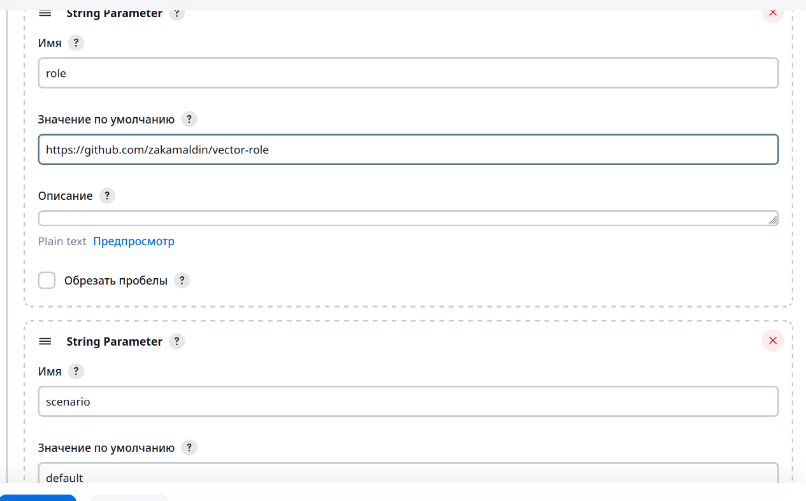
      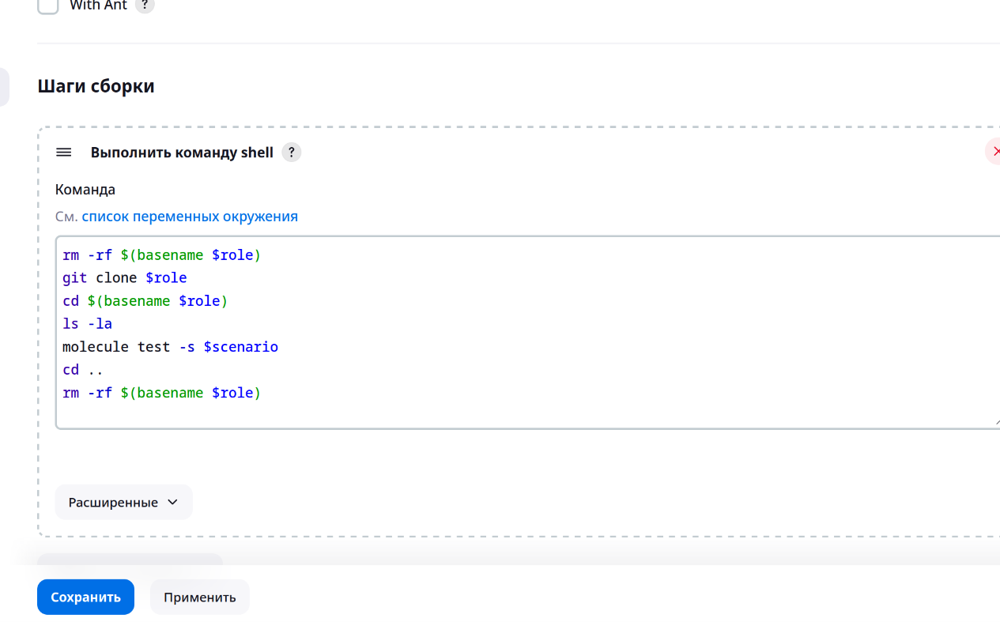
      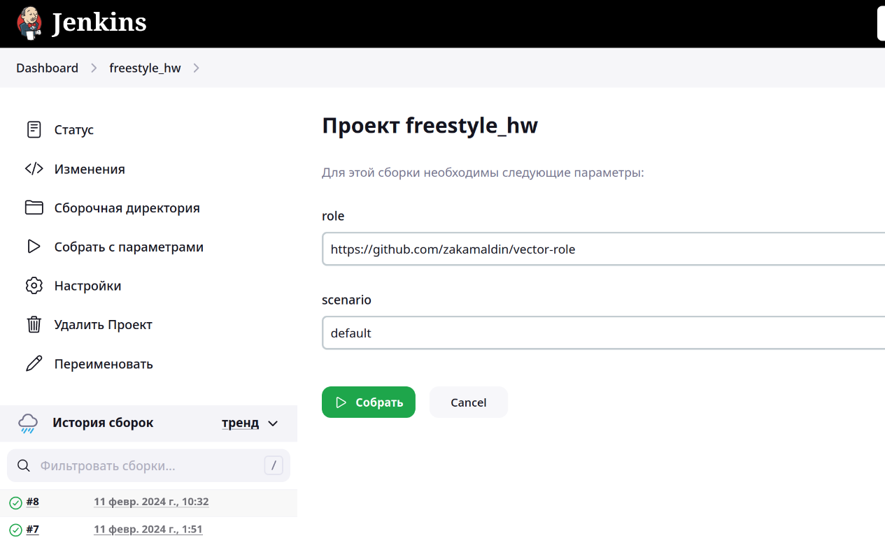
2. Сделать Declarative Pipeline Job, который будет запускать `molecule test` из любого вашего репозитория с ролью.
    ### Ответ:
      Создал декларативный пайп, пришлось добавить 3й парметр  сназванием роли, так как не получилось сменить рабочую директорию через `sh "cd $(basename $role)"`, 
      а внутри директивы `dir` необходимо прописать название директории, куда надо перемещаться
      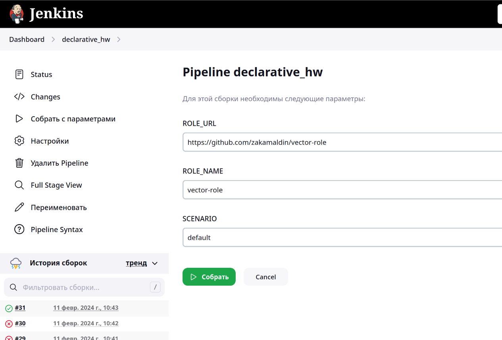
      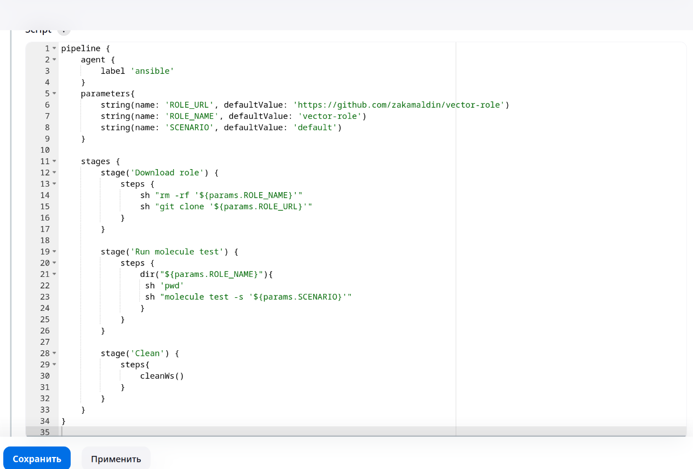
      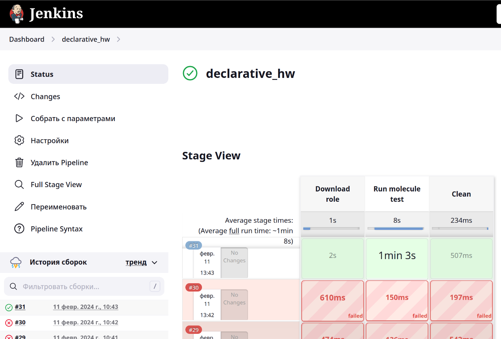
3. Перенести Declarative Pipeline в репозиторий в файл `Jenkinsfile`.
    ### Ответ:
      Перенес в `pipeline/Jenkinsfile_declarative`
      Создал пайплайн, указал текущий репозиторий, и пусть до файла исполнения
      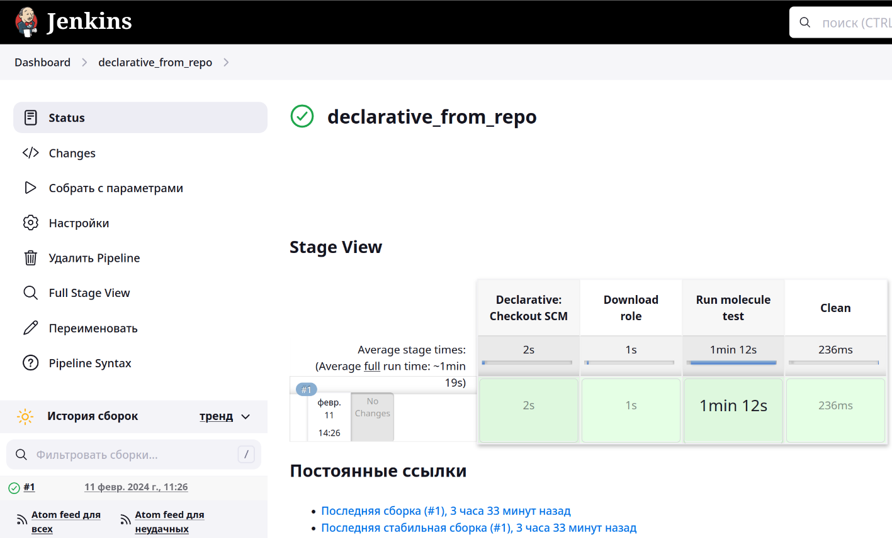
      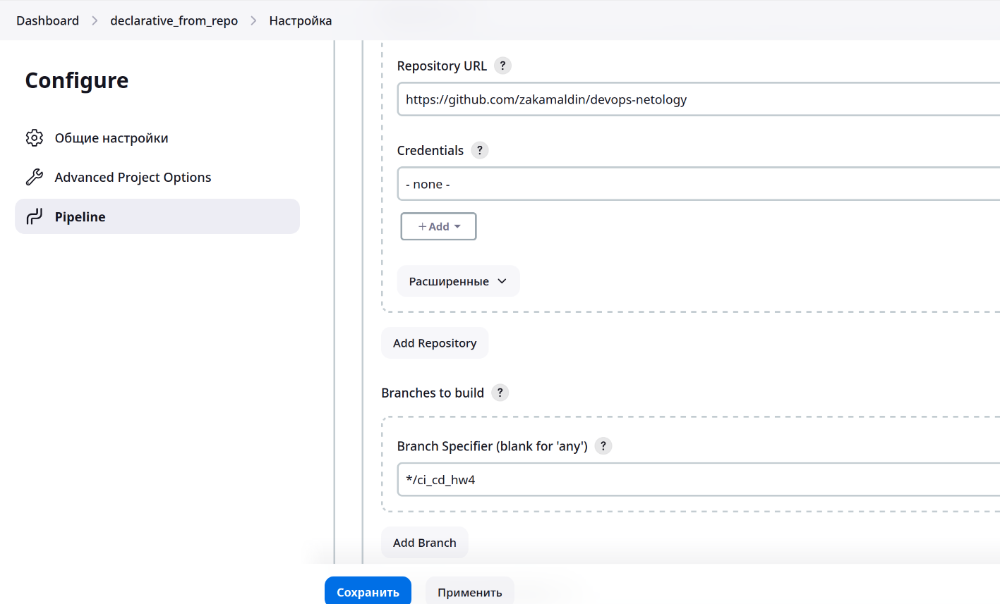
      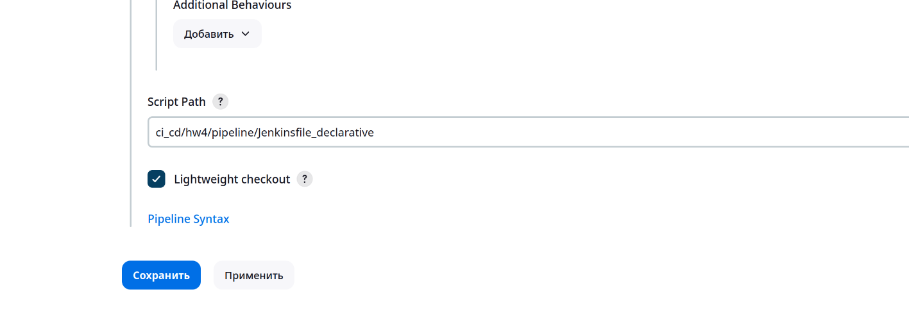

4. Создать Multibranch Pipeline на запуск `Jenkinsfile` из репозитория.
    ### Ответ:
      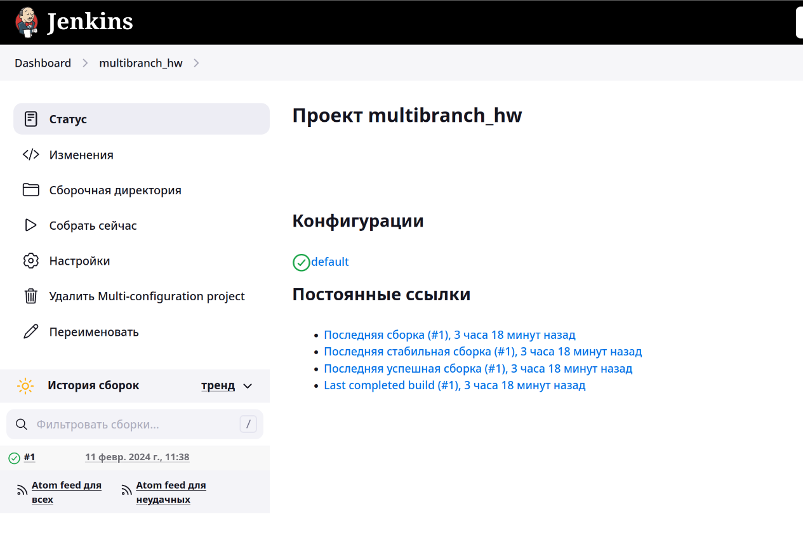
      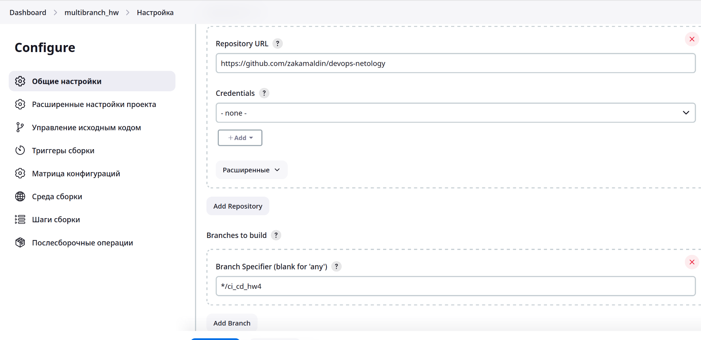
5. Создать Scripted Pipeline, наполнить его скриптом из [pipeline](./pipeline).
    ### Ответ:
      Создал джобу с двумя параметрами
      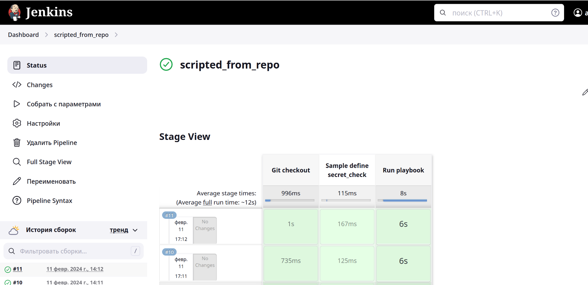
      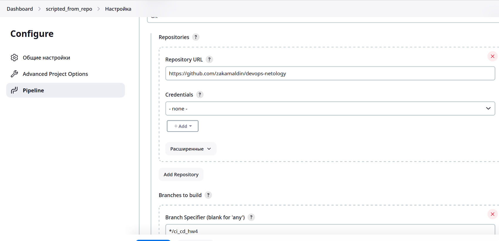
      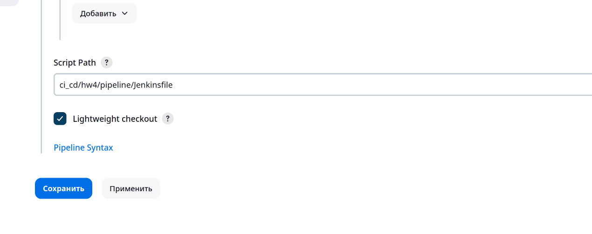
6. Внести необходимые изменения, чтобы Pipeline запускал `ansible-playbook` без флагов `--check --diff`, если не установлен параметр при запуске джобы (prod_run = True). По умолчанию параметр имеет значение False и запускает прогон с флагами `--check --diff`.
    ### Ответ:
      - Поправил ссылку с `ssh` -> `https`, так как для публичных репозиториев нет необходимости прописывать права.
      - Добавил параметр для запуска стипом `bool`
      - Поправил права для пользователя `jenkins` на агенте, так как сценарий падал при тасках с проставленным параметром `become: true`
      - Создал директорию `/opt/jdk/openjdk-11-linux` так как сценарий падал на таске `Extract java in the installation directory`
7. Проверить работоспособность, исправить ошибки, исправленный Pipeline вложить в репозиторий в файл `ScriptedJenkinsfile`.
8. Отправить ссылку на репозиторий с ролью и Declarative Pipeline и Scripted Pipeline.
9. Сопроводите процесс настройки скриншотами для каждого пункта задания!!
