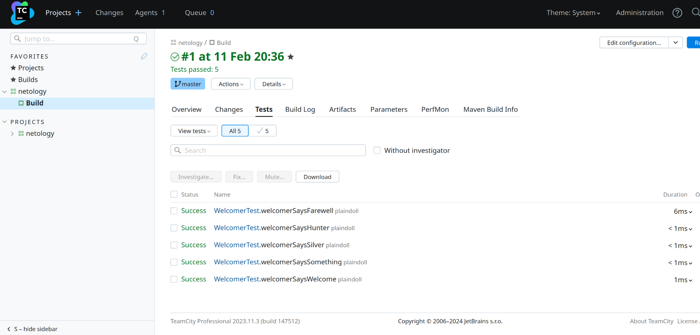
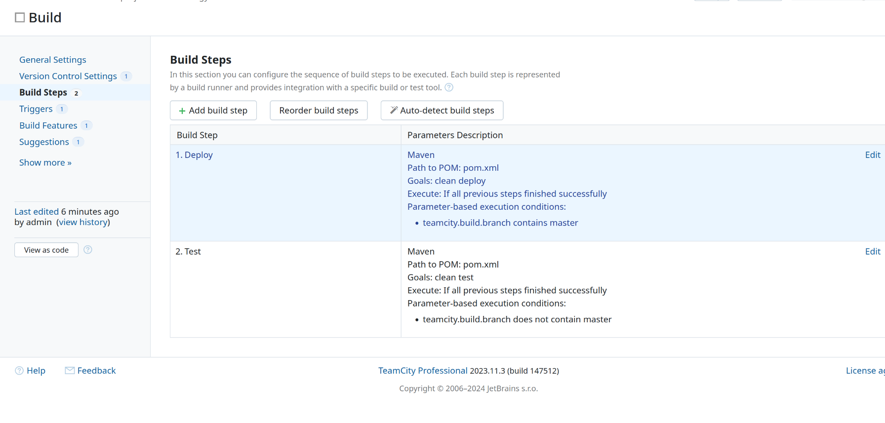
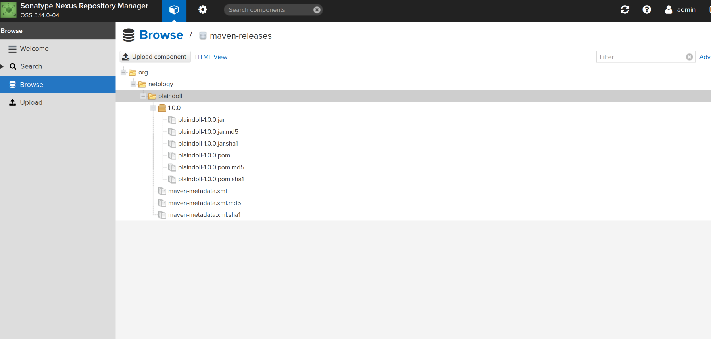
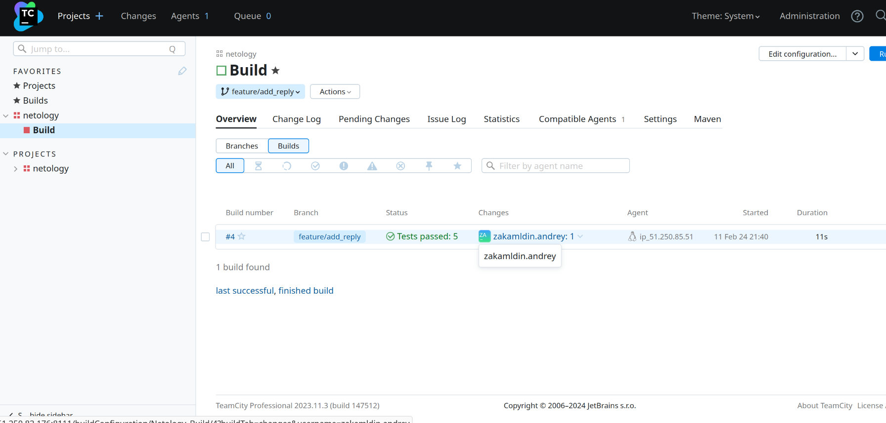
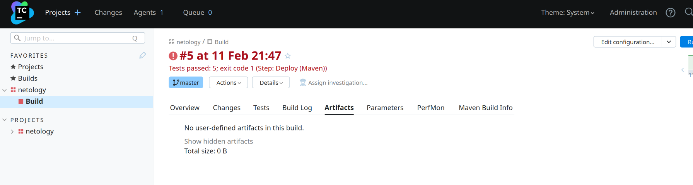
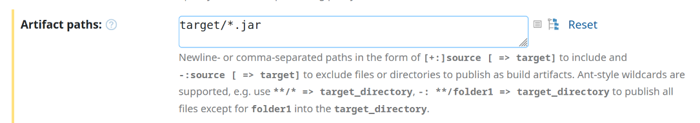
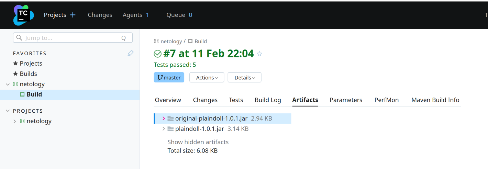

# Домашнее задание к занятию 11 «Teamcity»

## Подготовка к выполнению

1. В Yandex Cloud создайте новый инстанс (4CPU4RAM) на основе образа `jetbrains/teamcity-server`.
2. Дождитесь запуска teamcity, выполните первоначальную настройку.
3. Создайте ещё один инстанс (2CPU4RAM) на основе образа `jetbrains/teamcity-agent`. Пропишите к нему переменную окружения `SERVER_URL: "http://<teamcity_url>:8111"`.
4. Авторизуйте агент.
5. Сделайте fork [репозитория](https://github.com/aragastmatb/example-teamcity).
6. Создайте VM (2CPU4RAM) и запустите [playbook](./infrastructure).

## Основная часть

1. Создайте новый проект в teamcity на основе fork.
  ### Ответ:
    https://github.com/zakamaldin/example-teamcity    
2. Сделайте autodetect конфигурации.
3. Сохраните необходимые шаги, запустите первую сборку master.
  ### Ответ:
    
4. Поменяйте условия сборки: если сборка по ветке `master`, то должен происходит `mvn clean deploy`, иначе `mvn clean test`.
  ### Ответ:
  
5. Для deploy будет необходимо загрузить [settings.xml](./teamcity/settings.xml) в набор конфигураций maven у teamcity, предварительно записав туда креды для подключения к nexus.
6. В pom.xml необходимо поменять ссылки на репозиторий и nexus.
7. Запустите сборку по master, убедитесь, что всё прошло успешно и артефакт появился в nexus.
  ### Ответ:
  
8. Мигрируйте `build configuration` в репозиторий.
  ### Ответ:
    https://github.com/zakamaldin/example-teamcity/blob/master/settings.kts
9. Создайте отдельную ветку `feature/add_reply` в репозитории.
  ### Ответ:
    https://github.com/zakamaldin/example-teamcity/tree/feature/add_reply
10. Напишите новый метод для класса Welcomer: метод должен возвращать произвольную реплику, содержащую слово `hunter`.
11. Дополните тест для нового метода на поиск слова `hunter` в новой реплике.
12. Сделайте push всех изменений в новую ветку репозитория.
  ### Ответ:
    https://github.com/zakamaldin/example-teamcity/commit/90fc72c8047c84a6b4d6193dfa117af29eef7380
13. Убедитесь, что сборка самостоятельно запустилась, тесты прошли успешно.
  ### Ответ:
  
14. Внесите изменения из произвольной ветки `feature/add_reply` в `master` через `Merge`.
  ### Ответ:
    https://github.com/zakamaldin/example-teamcity/pull/1
15. Убедитесь, что нет собранного артефакта в сборке по ветке `master`.
  ### Ответ:
    Сборка упала, так как не поменяна версия внутри `pom.xml`
  
16. Настройте конфигурацию так, чтобы она собирала `.jar` в артефакты сборки.
  ### Ответ:
  
17. Проведите повторную сборку мастера, убедитесь, что сбора прошла успешно и артефакты собраны.
  ### Ответ:
  
18. Проверьте, что конфигурация в репозитории содержит все настройки конфигурации из teamcity.
19. В ответе пришлите ссылку на репозиторий.
  ### Ответ:
    https://github.com/zakamaldin/example-teamcity
