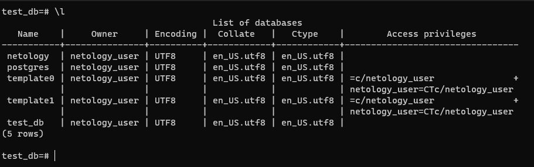
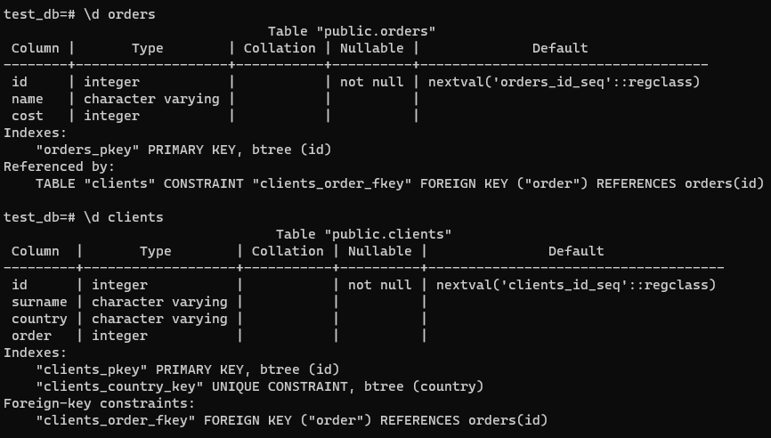
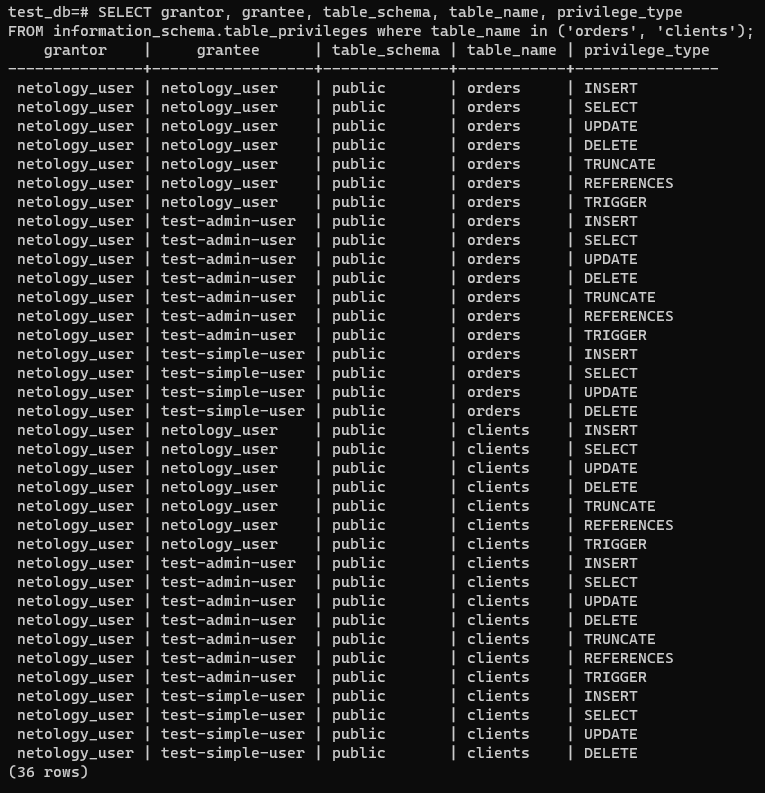
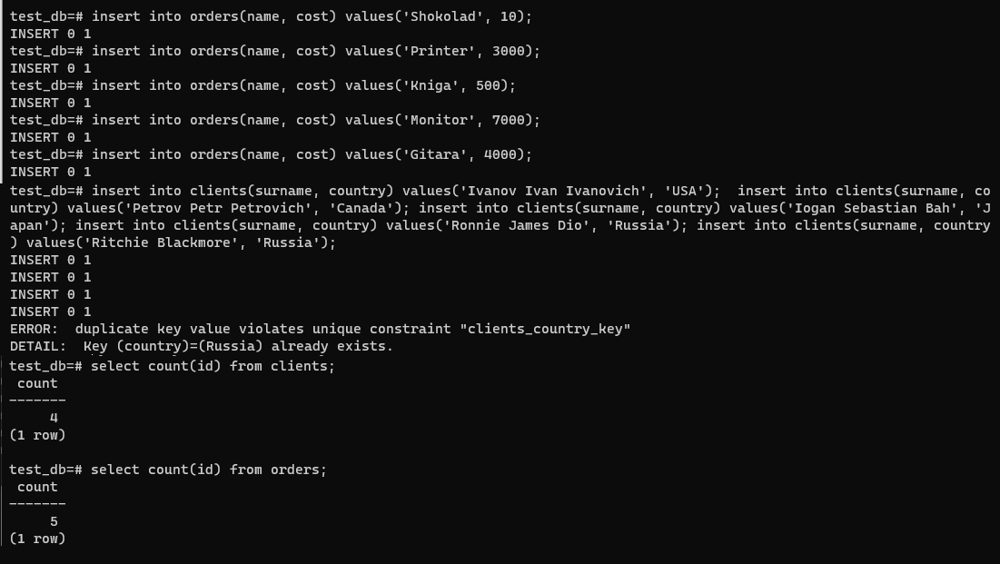
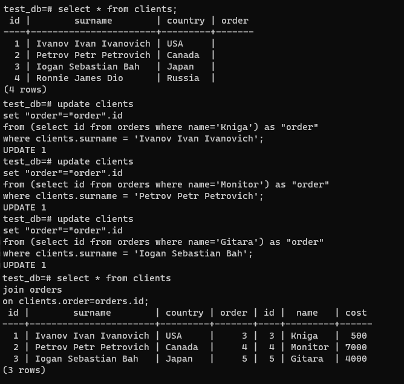
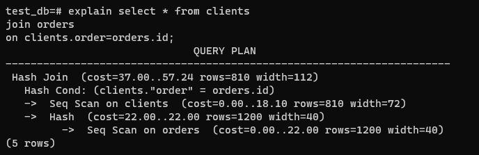
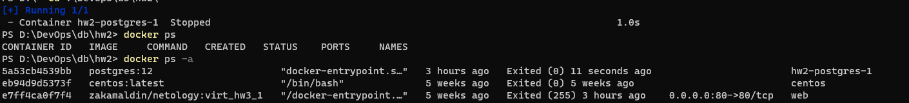
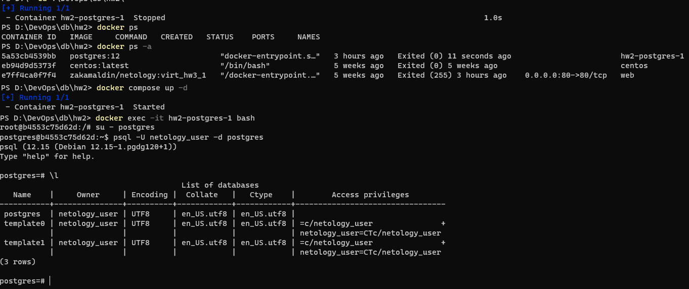
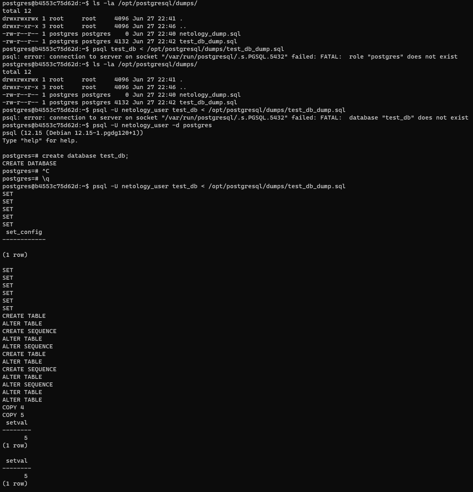
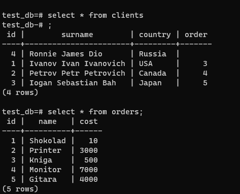

# Домашнее задание к занятию 2. «SQL»

## Задача 1

Используя Docker, поднимите инстанс PostgreSQL (версию 12) c 2 volume, 
в который будут складываться данные БД и бэкапы.

Приведите получившуюся команду или docker-compose-манифест.

### Ответ:

```yaml
version: "3.9"
services:
  postgres:
    image: postgres:12
    environment:
      POSTGRES_DB: "netology"
      POSTGRES_USER: "netology_user"
      POSTGRES_PASSWORD: "1234"
      PGDATA: "/var/lib/postgresql/data/pgdata"
    volumes:
      - ./pgdata:/var/lib/postgresql/data/pgdata
      - ./dumps:/opt/postgresql/dumps
    ports:
      - "5432:5432"

```

## Задача 2

В БД из задачи 1: 

- создайте пользователя test-admin-user и БД test_db;
- в БД test_db создайте таблицу orders и clients (спeцификация таблиц ниже);
- предоставьте привилегии на все операции пользователю test-admin-user на таблицы БД test_db;
- создайте пользователя test-simple-user;
- предоставьте пользователю test-simple-user права на SELECT/INSERT/UPDATE/DELETE этих таблиц БД test_db.

Таблица orders:

- id (serial primary key);
- наименование (string);
- цена (integer).

Таблица clients:

- id (serial primary key);
- фамилия (string);
- страна проживания (string, index);
- заказ (foreign key orders).

Приведите:

- итоговый список БД после выполнения пунктов выше;
- описание таблиц (describe);
- SQL-запрос для выдачи списка пользователей с правами над таблицами test_db;
- список пользователей с правами над таблицами test_db.

### Ответ:
- cписок баз
   
- описание таблиц
   
- sql-запрос

    ```sql
    SELECT grantor, grantee, table_schema, table_name, privilege_type
    FROM information_schema.table_privileges
    where table_name in ('orders', 'clients');
    ```
- результат
   
## Задача 3

Используя SQL-синтаксис, наполните таблицы следующими тестовыми данными:

Таблица orders

|Наименование|цена|
|------------|----|
|Шоколад| 10 |
|Принтер| 3000 |
|Книга| 500 |
|Монитор| 7000|
|Гитара| 4000|

Таблица clients

|ФИО|Страна проживания|
|------------|----|
|Иванов Иван Иванович| USA |
|Петров Петр Петрович| Canada |
|Иоганн Себастьян Бах| Japan |
|Ронни Джеймс Дио| Russia|
|Ritchie Blackmore| Russia|

Используя SQL-синтаксис:
- вычислите количество записей для каждой таблицы.

Приведите в ответе:

    - запросы,
    - результаты их выполнения.

### Ответ:
   

## Задача 4

Часть пользователей из таблицы clients решили оформить заказы из таблицы orders.

Используя foreign keys, свяжите записи из таблиц, согласно таблице:

|ФИО|Заказ|
|------------|----|
|Иванов Иван Иванович| Книга |
|Петров Петр Петрович| Монитор |
|Иоганн Себастьян Бах| Гитара |

Приведите SQL-запросы для выполнения этих операций.

Приведите SQL-запрос для выдачи всех пользователей, которые совершили заказ, а также вывод этого запроса.
 
Подсказка: используйте директиву `UPDATE`.

### Ответ:
   

## Задача 5

Получите полную информацию по выполнению запроса выдачи всех пользователей из задачи 4 
(используя директиву EXPLAIN).

Приведите получившийся результат и объясните, что значат полученные значения.

### Ответ:
- Seq Scan — последовательное, блок за блоком, чтение данных таблиц 
- cost — затраты на получение первой строки `..` всех строк
- rows — приблизительное количество возвращаемых строк при выполнении операции Seq Scan
- width — средний размер одной строки в байтах
- Hash - вычисление хэша для каждой строчки таблиц
- Hash Join - сравнение получившихся хэшей между двумя таблицами по услови Hash Cond
- Hash Cond - условие, сравнения хешей




## Задача 6

Создайте бэкап БД test_db и поместите его в volume, предназначенный для бэкапов (см. задачу 1).

Остановите контейнер с PostgreSQL, но не удаляйте volumes.

Поднимите новый пустой контейнер с PostgreSQL.

Восстановите БД test_db в новом контейнере.

Приведите список операций, который вы применяли для бэкапа данных и восстановления. 


### Ответ:
- снятие дампа 

    ```
    pg_dump test_db -U netology_user > /opt/postgresql/dumps/test_db_dump.sql
    ```
- остановка контейнера
    ``` 
    docker compose stop
    ```
    
- переподнятие контейнера
    ``` 
    docker compose up
    ```
    

- восстановление дампа(пришлось создать отдельно базу и роли перед накаткй дампа)
    ``` 
    psql -U netology_user test_db < /opt/postgresql/dumps/test_db_dump.sql
    ```
    
    

