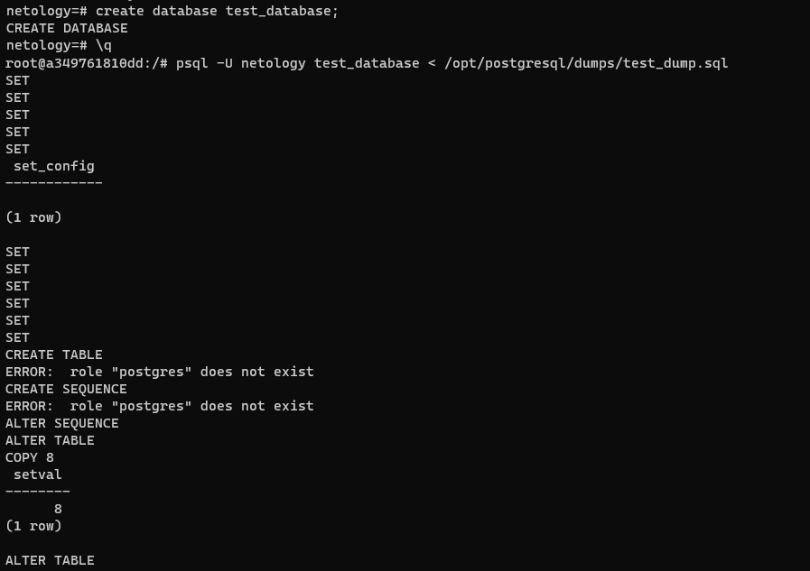

# Домашнее задание к занятию 4. «PostgreSQL»

## Задача 1

Используя Docker, поднимите инстанс PostgreSQL (версию 13). Данные БД сохраните в volume.

Подключитесь к БД PostgreSQL, используя `psql`.

Воспользуйтесь командой `\?` для вывода подсказки по имеющимся в `psql` управляющим командам.

**Найдите и приведите** управляющие команды для:

- вывода списка БД,
- подключения к БД,
- вывода списка таблиц,
- вывода описания содержимого таблиц,
- выхода из psql.

### Ответ:
- вывода списка БД - `\l`
- подключения к БД - `\c`
- вывода списка таблиц - `\dt`
- вывода описания содержимого таблиц - `\dt+`
- выхода из psql `\q`

## Задача 2

Используя `psql`, создайте БД `test_database`.

Изучите [бэкап БД](https://github.com/netology-code/virt-homeworks/tree/virt-11/06-db-04-postgresql/test_data).

Восстановите бэкап БД в `test_database`.

Перейдите в управляющую консоль `psql` внутри контейнера.

Подключитесь к восстановленной БД и проведите операцию ANALYZE для сбора статистики по таблице.

Используя таблицу [pg_stats](https://postgrespro.ru/docs/postgresql/12/view-pg-stats), найдите столбец таблицы `orders` 
с наибольшим средним значением размера элементов в байтах.

**Приведите в ответе** команду, которую вы использовали для вычисления, и полученный результат.

### Ответ:
  16 байт

    select avg_width, attname from pg_stats where tablename='orders';

   

    test_database=# analyze verbose;
    INFO:  analyzing "public.orders"
    INFO:  "orders": scanned 1 of 1 pages, containing 8 live rows and 0 dead rows; 8 rows in sample, 8 estimated total rows
    INFO:  analyzing "pg_catalog.pg_type"
    INFO:  "pg_type": scanned 10 of 10 pages, containing 414 live rows and 0 dead rows; 414 rows in sample, 414 estimated total rows
    INFO:  analyzing "pg_catalog.pg_foreign_table"
    INFO:  "pg_foreign_table": scanned 0 of 0 pages, containing 0 live rows and 0 dead rows; 0 rows in sample, 0 estimated total rows
    INFO:  analyzing "pg_catalog.pg_authid"
    INFO:  "pg_authid": scanned 1 of 1 pages, containing 9 live rows and 0 dead rows; 9 rows in sample, 9 estimated total rows
    INFO:  analyzing "pg_catalog.pg_statistic_ext_data"
    INFO:  "pg_statistic_ext_data": scanned 0 of 0 pages, containing 0 live rows and 0 dead rows; 0 rows in sample, 0 estimated total rows
    INFO:  analyzing "pg_catalog.pg_largeobject"
    INFO:  "pg_largeobject": scanned 0 of 0 pages, containing 0 live rows and 0 dead rows; 0 rows in sample, 0 estimated total rows
    INFO:  analyzing "pg_catalog.pg_user_mapping"
    INFO:  "pg_user_mapping": scanned 0 of 0 pages, containing 0 live rows and 0 dead rows; 0 rows in sample, 0 estimated total rows
    INFO:  analyzing "pg_catalog.pg_subscription"
    INFO:  "pg_subscription": scanned 0 of 0 pages, containing 0 live rows and 0 dead rows; 0 rows in sample, 0 estimated total rows
    INFO:  analyzing "pg_catalog.pg_attribute"
    INFO:  "pg_attribute": scanned 53 of 53 pages, containing 2880 live rows and 1 dead rows; 2880 rows in sample, 2880 estimated total rows
    INFO:  analyzing "pg_catalog.pg_proc"
    INFO:  "pg_proc": scanned 81 of 81 pages, containing 3034 live rows and 0 dead rows; 3034 rows in sample, 3034 estimated total rows
    INFO:  analyzing "pg_catalog.pg_class"
    INFO:  "pg_class": scanned 13 of 13 pages, containing 389 live rows and 0 dead rows; 389 rows in sample, 389 estimated total rows
    INFO:  analyzing "pg_catalog.pg_attrdef"
    INFO:  "pg_attrdef": scanned 1 of 1 pages, containing 2 live rows and 0 dead rows; 2 rows in sample, 2 estimated total rows
    INFO:  analyzing "pg_catalog.pg_constraint"
    INFO:  "pg_constraint": scanned 1 of 1 pages, containing 3 live rows and 0 dead rows; 3 rows in sample, 3 estimated total rows
    INFO:  analyzing "pg_catalog.pg_inherits"
    INFO:  "pg_inherits": scanned 0 of 0 pages, containing 0 live rows and 0 dead rows; 0 rows in sample, 0 estimated total rows
    INFO:  analyzing "pg_catalog.pg_index"
    INFO:  "pg_index": scanned 4 of 4 pages, containing 155 live rows and 0 dead rows; 155 rows in sample, 155 estimated total rows
    INFO:  analyzing "pg_catalog.pg_operator"
    INFO:  "pg_operator": scanned 14 of 14 pages, containing 784 live rows and 0 dead rows; 784 rows in sample, 784 estimated total rows
    INFO:  analyzing "pg_catalog.pg_opfamily"
    INFO:  "pg_opfamily": scanned 2 of 2 pages, containing 109 live rows and 0 dead rows; 109 rows in sample, 109 estimated total rows
    INFO:  analyzing "pg_catalog.pg_opclass"
    INFO:  "pg_opclass": scanned 2 of 2 pages, containing 130 live rows and 0 dead rows; 130 rows in sample, 130 estimated total rows
    INFO:  analyzing "pg_catalog.pg_am"
    INFO:  "pg_am": scanned 1 of 1 pages, containing 7 live rows and 0 dead rows; 7 rows in sample, 7 estimated total rows
    INFO:  analyzing "pg_catalog.pg_amop"
    INFO:  "pg_amop": scanned 6 of 6 pages, containing 723 live rows and 0 dead rows; 723 rows in sample, 723 estimated total rows
    INFO:  analyzing "pg_catalog.pg_amproc"
    INFO:  "pg_amproc": scanned 4 of 4 pages, containing 483 live rows and 0 dead rows; 483 rows in sample, 483 estimated total rows
    INFO:  analyzing "pg_catalog.pg_language"
    INFO:  "pg_language": scanned 1 of 1 pages, containing 4 live rows and 0 dead rows; 4 rows in sample, 4 estimated total rows
    INFO:  analyzing "pg_catalog.pg_largeobject_metadata"
    INFO:  "pg_largeobject_metadata": scanned 0 of 0 pages, containing 0 live rows and 0 dead rows; 0 rows in sample, 0 estimated total rows
    INFO:  analyzing "pg_catalog.pg_aggregate"
    INFO:  "pg_aggregate": scanned 2 of 2 pages, containing 138 live rows and 0 dead rows; 138 rows in sample, 138 estimated total rows
    INFO:  analyzing "pg_catalog.pg_statistic_ext"
    INFO:  "pg_statistic_ext": scanned 0 of 0 pages, containing 0 live rows and 0 dead rows; 0 rows in sample, 0 estimated total rows
    INFO:  analyzing "pg_catalog.pg_rewrite"
    INFO:  "pg_rewrite": scanned 12 of 12 pages, containing 130 live rows and 0 dead rows; 130 rows in sample, 130 estimated total rows
    INFO:  analyzing "pg_catalog.pg_trigger"
    INFO:  "pg_trigger": scanned 0 of 0 pages, containing 0 live rows and 0 dead rows; 0 rows in sample, 0 estimated total rows
    INFO:  analyzing "pg_catalog.pg_event_trigger"
    INFO:  "pg_event_trigger": scanned 0 of 0 pages, containing 0 live rows and 0 dead rows; 0 rows in sample, 0 estimated total rows
    INFO:  analyzing "pg_catalog.pg_description"
    INFO:  "pg_description": scanned 42 of 42 pages, containing 4889 live rows and 0 dead rows; 4889 rows in sample, 4889 estimated total rows
    INFO:  analyzing "pg_catalog.pg_cast"
    INFO:  "pg_cast": scanned 2 of 2 pages, containing 224 live rows and 0 dead rows; 224 rows in sample, 224 estimated total rows
    INFO:  analyzing "pg_catalog.pg_enum"
    INFO:  "pg_enum": scanned 0 of 0 pages, containing 0 live rows and 0 dead rows; 0 rows in sample, 0 estimated total rows
    INFO:  analyzing "pg_catalog.pg_namespace"
    INFO:  "pg_namespace": scanned 1 of 1 pages, containing 4 live rows and 0 dead rows; 4 rows in sample, 4 estimated total rows
    INFO:  analyzing "pg_catalog.pg_conversion"
    INFO:  "pg_conversion": scanned 2 of 2 pages, containing 128 live rows and 0 dead rows; 128 rows in sample, 128 estimated total rows
    INFO:  analyzing "pg_catalog.pg_depend"
    INFO:  "pg_depend": scanned 57 of 57 pages, containing 7736 live rows and 0 dead rows; 7736 rows in sample, 7736 estimated total rows
    INFO:  analyzing "pg_catalog.pg_database"
    INFO:  "pg_database": scanned 1 of 1 pages, containing 5 live rows and 0 dead rows; 5 rows in sample, 5 estimated total rows
    INFO:  analyzing "pg_catalog.pg_db_role_setting"
    INFO:  "pg_db_role_setting": scanned 0 of 0 pages, containing 0 live rows and 0 dead rows; 0 rows in sample, 0 estimated total rows
    INFO:  analyzing "pg_catalog.pg_tablespace"
    INFO:  "pg_tablespace": scanned 1 of 1 pages, containing 2 live rows and 0 dead rows; 2 rows in sample, 2 estimated total rows
    INFO:  analyzing "pg_catalog.pg_auth_members"
    INFO:  "pg_auth_members": scanned 1 of 1 pages, containing 3 live rows and 0 dead rows; 3 rows in sample, 3 estimated total rows
    INFO:  analyzing "pg_catalog.pg_shdepend"
    INFO:  "pg_shdepend": scanned 1 of 1 pages, containing 9 live rows and 0 dead rows; 9 rows in sample, 9 estimated total rows
    INFO:  analyzing "pg_catalog.pg_shdescription"
    INFO:  "pg_shdescription": scanned 1 of 1 pages, containing 3 live rows and 0 dead rows; 3 rows in sample, 3 estimated total rows
    INFO:  analyzing "pg_catalog.pg_ts_config"
    INFO:  "pg_ts_config": scanned 1 of 1 pages, containing 23 live rows and 0 dead rows; 23 rows in sample, 23 estimated total rows
    INFO:  analyzing "pg_catalog.pg_ts_config_map"
    INFO:  "pg_ts_config_map": scanned 3 of 3 pages, containing 437 live rows and 0 dead rows; 437 rows in sample, 437 estimated total rows
    INFO:  analyzing "pg_catalog.pg_ts_dict"
    INFO:  "pg_ts_dict": scanned 1 of 1 pages, containing 23 live rows and 0 dead rows; 23 rows in sample, 23 estimated total rows
    INFO:  analyzing "pg_catalog.pg_ts_parser"
    INFO:  "pg_ts_parser": scanned 1 of 1 pages, containing 1 live rows and 0 dead rows; 1 rows in sample, 1 estimated total rows
    INFO:  analyzing "pg_catalog.pg_ts_template"
    INFO:  "pg_ts_template": scanned 1 of 1 pages, containing 5 live rows and 0 dead rows; 5 rows in sample, 5 estimated total rows
    INFO:  analyzing "pg_catalog.pg_extension"
    INFO:  "pg_extension": scanned 1 of 1 pages, containing 1 live rows and 0 dead rows; 1 rows in sample, 1 estimated total rows
    INFO:  analyzing "pg_catalog.pg_foreign_data_wrapper"
    INFO:  "pg_foreign_data_wrapper": scanned 0 of 0 pages, containing 0 live rows and 0 dead rows; 0 rows in sample, 0 estimated total rows
    INFO:  analyzing "pg_catalog.pg_foreign_server"
    INFO:  "pg_foreign_server": scanned 0 of 0 pages, containing 0 live rows and 0 dead rows; 0 rows in sample, 0 estimated total rows
    INFO:  analyzing "pg_catalog.pg_policy"
    INFO:  "pg_policy": scanned 0 of 0 pages, containing 0 live rows and 0 dead rows; 0 rows in sample, 0 estimated total rows
    INFO:  analyzing "pg_catalog.pg_replication_origin"
    INFO:  "pg_replication_origin": scanned 0 of 0 pages, containing 0 live rows and 0 dead rows; 0 rows in sample, 0 estimated total rows
    INFO:  analyzing "pg_catalog.pg_default_acl"
    INFO:  "pg_default_acl": scanned 0 of 0 pages, containing 0 live rows and 0 dead rows; 0 rows in sample, 0 estimated total rows
    INFO:  analyzing "pg_catalog.pg_init_privs"
    INFO:  "pg_init_privs": scanned 2 of 2 pages, containing 176 live rows and 0 dead rows; 176 rows in sample, 176 estimated total rows
    INFO:  analyzing "pg_catalog.pg_seclabel"
    INFO:  "pg_seclabel": scanned 0 of 0 pages, containing 0 live rows and 0 dead rows; 0 rows in sample, 0 estimated total rows
    INFO:  analyzing "pg_catalog.pg_shseclabel"
    INFO:  "pg_shseclabel": scanned 0 of 0 pages, containing 0 live rows and 0 dead rows; 0 rows in sample, 0 estimated total rows
    INFO:  analyzing "pg_catalog.pg_collation"
    INFO:  "pg_collation": scanned 26 of 26 pages, containing 813 live rows and 0 dead rows; 813 rows in sample, 813 estimated total rows
    INFO:  analyzing "pg_catalog.pg_partitioned_table"
    INFO:  "pg_partitioned_table": scanned 0 of 0 pages, containing 0 live rows and 0 dead rows; 0 rows in sample, 0 estimated total rows
    INFO:  analyzing "pg_catalog.pg_range"
    INFO:  "pg_range": scanned 1 of 1 pages, containing 6 live rows and 0 dead rows; 6 rows in sample, 6 estimated total rows
    INFO:  analyzing "pg_catalog.pg_transform"
    INFO:  "pg_transform": scanned 0 of 0 pages, containing 0 live rows and 0 dead rows; 0 rows in sample, 0 estimated total rows
    INFO:  analyzing "pg_catalog.pg_sequence"
    INFO:  "pg_sequence": scanned 1 of 1 pages, containing 1 live rows and 1 dead rows; 1 rows in sample, 1 estimated total rows
    INFO:  analyzing "pg_catalog.pg_publication"
    INFO:  "pg_publication": scanned 0 of 0 pages, containing 0 live rows and 0 dead rows; 0 rows in sample, 0 estimated total rows
    INFO:  analyzing "pg_catalog.pg_publication_rel"
    INFO:  "pg_publication_rel": scanned 0 of 0 pages, containing 0 live rows and 0 dead rows; 0 rows in sample, 0 estimated total rows
    INFO:  analyzing "pg_catalog.pg_subscription_rel"
    INFO:  "pg_subscription_rel": scanned 0 of 0 pages, containing 0 live rows and 0 dead rows; 0 rows in sample, 0 estimated total rows
    INFO:  analyzing "information_schema.sql_implementation_info"
    INFO:  "sql_implementation_info": scanned 1 of 1 pages, containing 12 live rows and 0 dead rows; 12 rows in sample, 12 estimated total rows
    INFO:  analyzing "information_schema.sql_parts"
    INFO:  "sql_parts": scanned 1 of 1 pages, containing 10 live rows and 0 dead rows; 10 rows in sample, 10 estimated total rows
    INFO:  analyzing "information_schema.sql_sizing"
    INFO:  "sql_sizing": scanned 1 of 1 pages, containing 23 live rows and 0 dead rows; 23 rows in sample, 23 estimated total rows
    INFO:  analyzing "information_schema.sql_features"
    INFO:  "sql_features": scanned 8 of 8 pages, containing 712 live rows and 0 dead rows; 712 rows in sample, 712 estimated total rows
    ANALYZE

## Задача 3

Архитектор и администратор БД выяснили, что ваша таблица orders разрослась до невиданных размеров и
поиск по ней занимает долгое время. Вам как успешному выпускнику курсов DevOps в Нетологии предложили
провести разбиение таблицы на 2: шардировать на orders_1 - price>499 и orders_2 - price<=499.

Предложите SQL-транзакцию для проведения этой операции.

Можно ли было изначально исключить ручное разбиение при проектировании таблицы orders?

### Ответ:

```sql
BEGIN;

CREATE TABLE orders_with_price_500_and_more(
    CHECK ( price > 499 )
) INHERITS (orders);

CREATE TABLE orders_with_price_less_then_500(
    CHECK ( price <= 499 )
) INHERITS (orders);

CREATE RULE rule_orders_with_price_500_and_more AS ON INSERT TO orders
WHERE (price > 499)
DO INSTEAD INSERT INTO orders_with_price_500_and_more VALUES (NEW.*);

CREATE RULE rule_orders_with_price_less_then_500 AS ON INSERT TO orders
WHERE (price <= 499)
DO INSTEAD INSERT INTO orders_with_price_less_then_500 VALUES (NEW.*);

COMMIT;
```

Однако шардирование сработает толькодля новых данных, уже имеющиеся можно перенести так:

```sql
WITH more_then_500_rows AS (
    DELETE FROM orders WHERE price > 499 RETURNING *
) INSERT INTO rule_orders_with_price_500_and_more SELECT * FROM more_then_500_rows;

WITH less_then_500_rows AS (
    DELETE FROM orders WHERE price  <= 499 RETURNING *
) INSERT INTO orders_with_price_less_then_500 SELECT * FROM less_then_500_rows;
```
## Задача 4

Используя утилиту `pg_dump`, создайте бекап БД `test_database`.

Как бы вы доработали бэкап-файл, чтобы добавить уникальность значения столбца `title` для таблиц `test_database`?


### Ответ:

- Снятие дампа:
        
        pg_dump test_database -U netology > /opt/postgresql/dumps/test_db_dump_new.sql
- Уникальность значения столбца `title`
    ```sql
    ALTER TABLE orders ADD CONSTRAINT orders_title_unique UNIQUE(title);
    ALTER TABLE orderorders_with_price_500_and_mores_1 ADD CONSTRAINT orders_with_price_500_and_more_title_unique UNIQUE(title);
    ALTER TABLE orders_with_price_less_then_500 ADD CONSTRAINT orders_with_price_less_then_500_title_unique UNIQUE(title);
    ```
