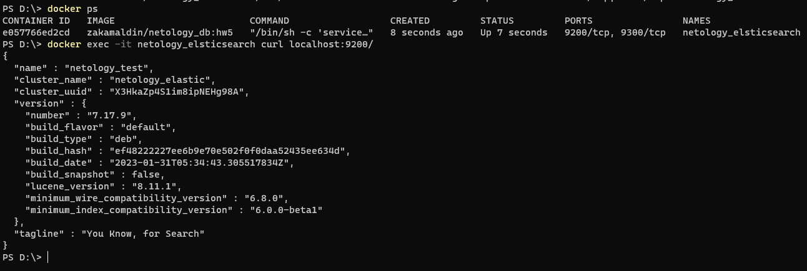
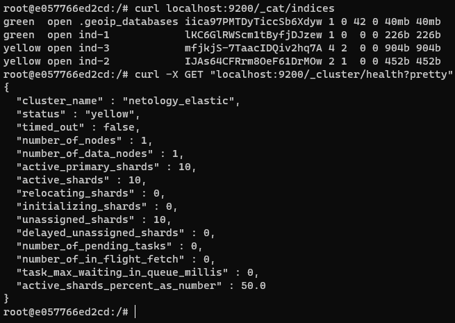
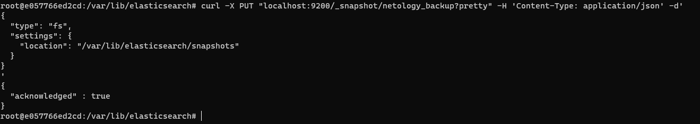
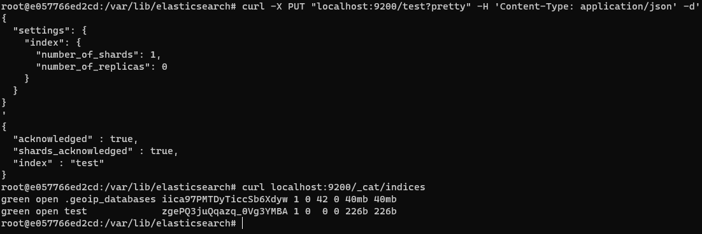
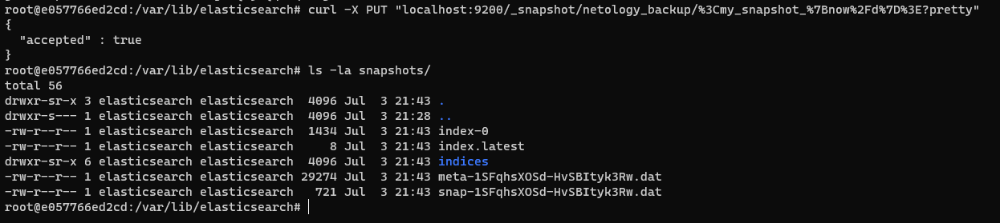
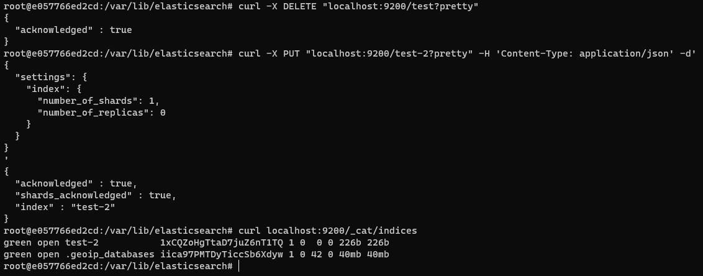
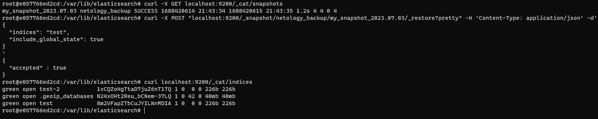

# Домашнее задание к занятию 5. «Elasticsearch»

## Задача 1

В этом задании вы потренируетесь в:

- установке Elasticsearch,
- первоначальном конфигурировании Elasticsearch,
- запуске Elasticsearch в Docker.

Используя Docker-образ [centos:7](https://hub.docker.com/_/centos) как базовый и 
[документацию по установке и запуску Elastcisearch](https://www.elastic.co/guide/en/elasticsearch/reference/current/targz.html):

- составьте Dockerfile-манифест для Elasticsearch,
- соберите Docker-образ и сделайте `push` в ваш docker.io-репозиторий,
- запустите контейнер из получившегося образа и выполните запрос пути `/` c хост-машины.

Требования к `elasticsearch.yml`:

- данные `path` должны сохраняться в `/var/lib`,
- имя ноды должно быть `netology_test`.

В ответе приведите:

- текст Dockerfile-манифеста,
- ссылку на образ в репозитории dockerhub,
- ответ `Elasticsearch` на запрос пути `/` в json-виде.

### Ответ:

- Dockerfile:

```yaml
FROM ubuntu:22.10
RUN apt update && apt install -y wget curl && \
    wget https://mirror.yandex.ru/mirrors/elastic/7/pool/main/e/elasticsearch/elasticsearch-7.17.9-amd64.deb && \
    apt install -y /elasticsearch-7.17.9-amd64.deb

COPY elasticsearch.yml /etc/elasticsearch/elasticsearch.yml

ENTRYPOINT service elasticsearch start && tail -F /var/log/elasticsearch/netology_elastic.log
EXPOSE 9200 9300
```
- elasticsearch.yml

```yaml
cluster.name: netology_elastic
node.name: netology_test
path.data: /var/lib/elasticsearch
path.logs: /var/log/elasticsearch
```
- Ответ от elasticsearch
    


## Задача 2

В этом задании вы научитесь:

- создавать и удалять индексы,
- изучать состояние кластера,
- обосновывать причину деградации доступности данных.

Ознакомьтесь с [документацией](https://www.elastic.co/guide/en/elasticsearch/reference/current/indices-create-index.html) 
и добавьте в `Elasticsearch` 3 индекса в соответствии с таблицей:

| Имя | Количество реплик | Количество шард |
|-----|-------------------|-----------------|
| ind-1| 0 | 1 |
| ind-2 | 1 | 2 |
| ind-3 | 2 | 4 |

Получите список индексов и их статусов, используя API, и **приведите в ответе** на задание.

Получите состояние кластера `Elasticsearch`, используя API.

Как вы думаете, почему часть индексов и кластер находятся в состоянии yellow?

Удалите все индексы.

**Важно**

При проектировании кластера Elasticsearch нужно корректно рассчитывать количество реплик и шард,
иначе возможна потеря данных индексов, вплоть до полной, при деградации системы.

### Ответ:

Индексы находятся в состоянии yellow так как у нас есть только одна нода, но в настройках индексов `ind-2` и `ind-3` было указано болmшее количество реплик чем есть нод




## Задача 3

В этом задании вы научитесь:

- создавать бэкапы данных,
- восстанавливать индексы из бэкапов.

Создайте директорию `{путь до корневой директории с Elasticsearch в образе}/snapshots`.

Используя API, [зарегистрируйте](https://www.elastic.co/guide/en/elasticsearch/reference/current/snapshots-register-repository.html#snapshots-register-repository) 
эту директорию как `snapshot repository` c именем `netology_backup`.

**Приведите в ответе** запрос API и результат вызова API для создания репозитория.

Создайте индекс `test` с 0 реплик и 1 шардом и **приведите в ответе** список индексов.

[Создайте `snapshot`](https://www.elastic.co/guide/en/elasticsearch/reference/current/snapshots-take-snapshot.html) 
состояния кластера `Elasticsearch`.

**Приведите в ответе** список файлов в директории со `snapshot`.

Удалите индекс `test` и создайте индекс `test-2`. **Приведите в ответе** список индексов.

[Восстановите](https://www.elastic.co/guide/en/elasticsearch/reference/current/snapshots-restore-snapshot.html) состояние
кластера `Elasticsearch` из `snapshot`, созданного ранее. 

**Приведите в ответе** запрос к API восстановления и итоговый список индексов.

Подсказки:

- возможно, вам понадобится доработать `elasticsearch.yml` в части директивы `path.repo` и перезапустить `Elasticsearch`.

### Ответ:

- Создание репозитория 


- Создание индекса `test` и список индексов


- Создание снапшота


- Удаление индекса `test` и создание индекса `test-2`


- Восстановление бэкапа

