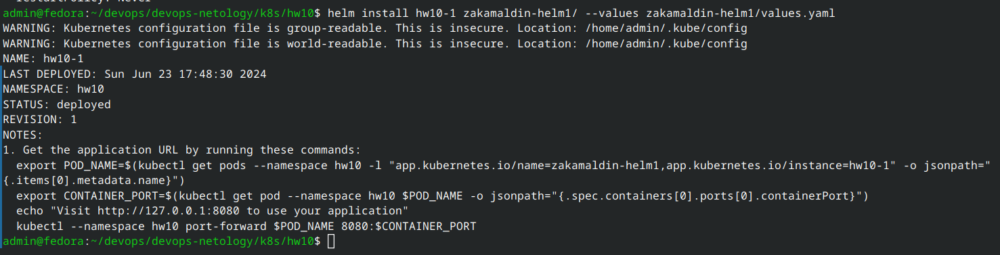
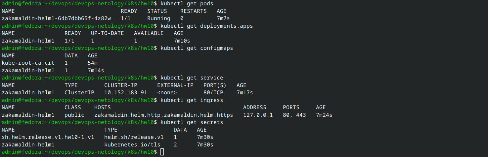
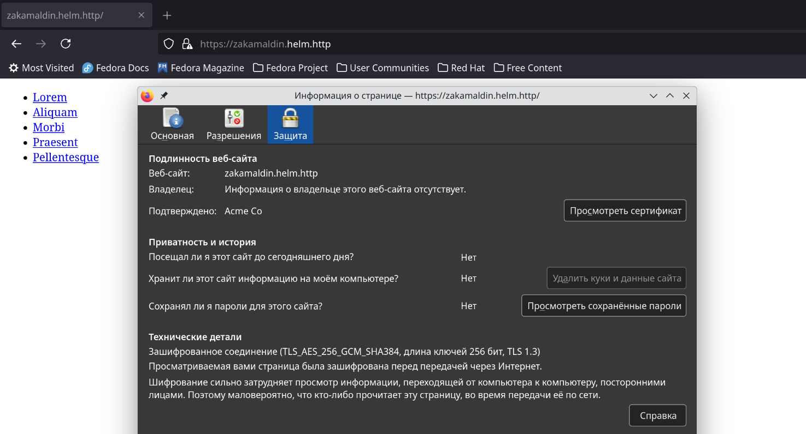
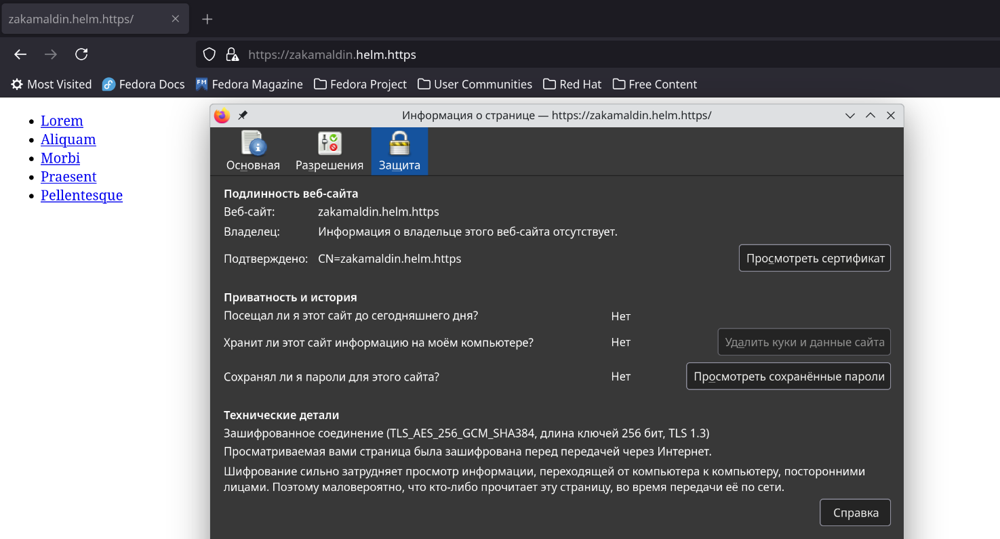
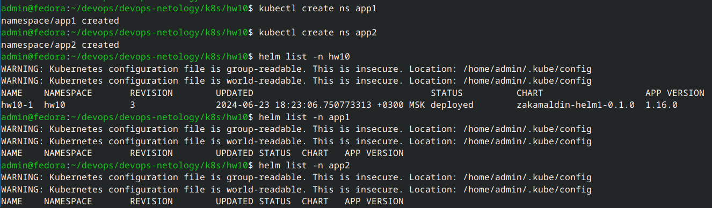
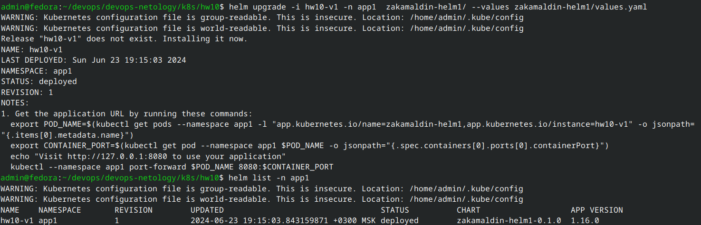
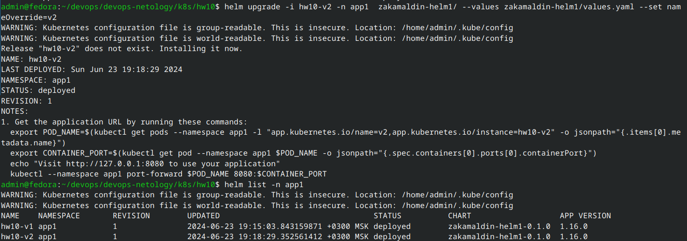

# Домашнее задание к занятию «Helm»

### Цель задания

В тестовой среде Kubernetes необходимо установить и обновить приложения с помощью Helm.

------

### Чеклист готовности к домашнему заданию

1. Установленное k8s-решение, например, MicroK8S.
2. Установленный локальный kubectl.
3. Установленный локальный Helm.
4. Редактор YAML-файлов с подключенным репозиторием GitHub.

------

### Инструменты и дополнительные материалы, которые пригодятся для выполнения задания

1. [Инструкция](https://helm.sh/docs/intro/install/) по установке Helm. [Helm completion](https://helm.sh/docs/helm/helm_completion/).

------

### Задание 1. Подготовить Helm-чарт для приложения

1. Необходимо упаковать приложение в чарт для деплоя в разные окружения. 
2. Каждый компонент приложения деплоится отдельным deployment’ом или statefulset’ом.
3. В переменных чарта измените образ приложения для изменения версии.

### Ответ:
Решил за основу chart взять домашнее задание к занятию «Конфигурация приложений» - [hw8](https://github.com/zakamaldin/devops-netology/blob/k8s_hw9/k8s/hw8/README.md)

Переделал дефолтный chart, добавил шаблон  для `ConfigMap` и `Secret`. Собрал, установил в кластер, се успешно.

Манифесты для chart лежат в директории [zakamaldin-helm1/templates](zakamaldin-helm1/templates/)

Упакованный chart лежит в [zakamaldin-helm1-0.1.0.tgz](zakamaldin-helm1-0.1.0.tgz)

#### Успешная установка в кластер: 

#### Манифесты в кластере после установки chart:

#### HTTP хост zakamaldin.helm.http:
Тут кластер microk8s сам редиректит на https, однакомы видно что серт от кубера, а не мой из секрета

#### HTTPs хост zakamaldin.helm.https:
Тут уже используется самоподписанный серт

------
### Задание 2. Запустить две версии в разных неймспейсах

1. Подготовив чарт, необходимо его проверить. Запуститe несколько копий приложения.
2. Одну версию в namespace=app1, вторую версию в том же неймспейсе, третью версию в namespace=app2.
3. Продемонстрируйте результат.

### Ответ:
#### Создаем неймспейсы: 

#### Деплой первой версии в неймспейс app1: 

#### Деплой второй версии в неймспейс app1: 
Пришлось подшаманить с `values`, выставил параметр `--set nameOverride=v2`, а то не создавался секрет

#### Деплой третьей версии в неймспейс app2: 

### Правила приёма работы

1. Домашняя работа оформляется в своём Git репозитории в файле README.md. Выполненное домашнее задание пришлите ссылкой на .md-файл в вашем репозитории.
2. Файл README.md должен содержать скриншоты вывода необходимых команд `kubectl`, `helm`, а также скриншоты результатов.
3. Репозиторий должен содержать тексты манифестов или ссылки на них в файле README.md.

