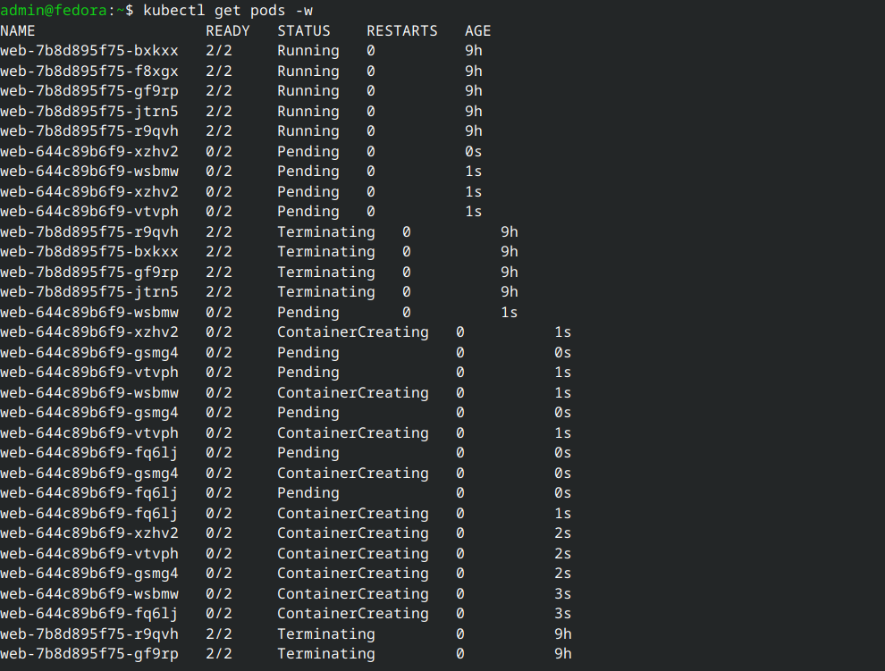
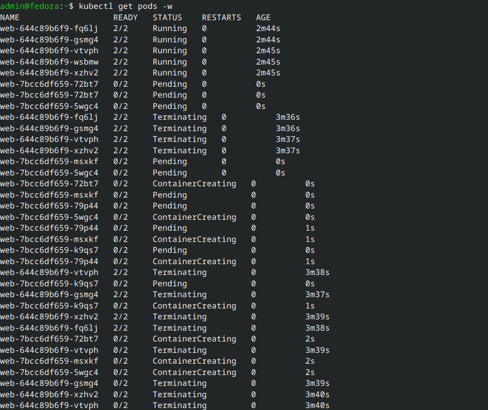
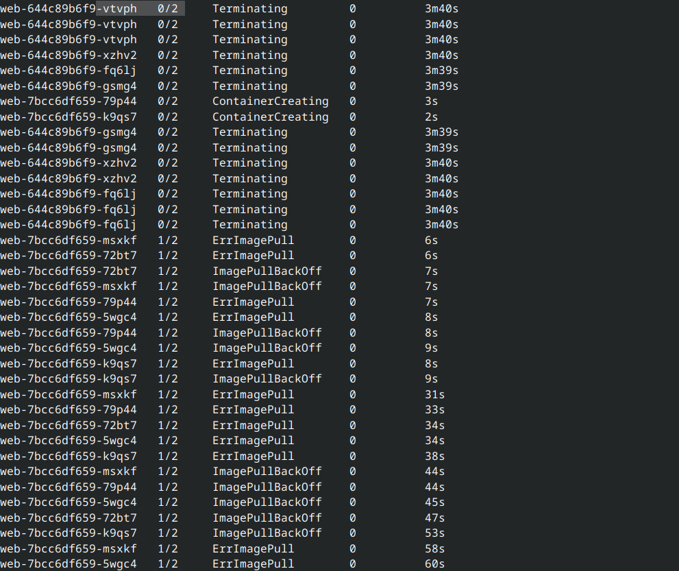
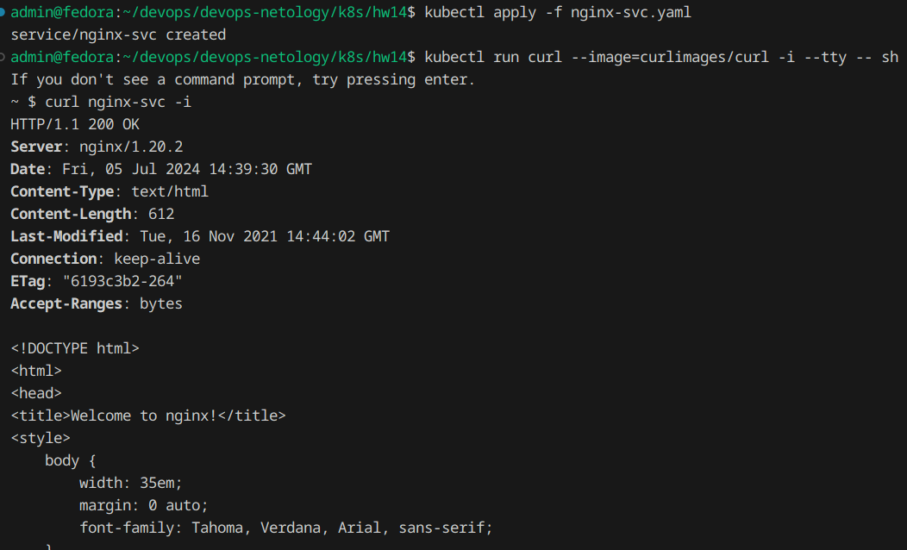
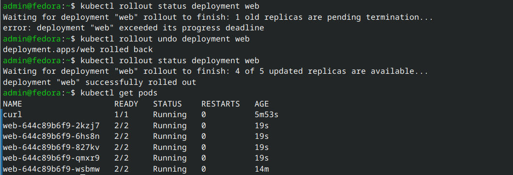

# Домашнее задание к занятию «Обновление приложений»

### Цель задания

Выбрать и настроить стратегию обновления приложения.

### Чеклист готовности к домашнему заданию

1. Кластер K8s.

### Инструменты и дополнительные материалы, которые пригодятся для выполнения задания

1. [Документация Updating a Deployment](https://kubernetes.io/docs/concepts/workloads/controllers/deployment/#updating-a-deployment).
2. [Статья про стратегии обновлений](https://habr.com/ru/companies/flant/articles/471620/).

-----

### Задание 1. Выбрать стратегию обновления приложения и описать ваш выбор

1. Имеется приложение, состоящее из нескольких реплик, которое требуется обновить.
2. Ресурсы, выделенные для приложения, ограничены, и нет возможности их увеличить.
3. Запас по ресурсам в менее загруженный момент времени составляет 20%.
4. Обновление мажорное, новые версии приложения не умеют работать со старыми.
5. Вам нужно объяснить свой выбор стратегии обновления приложения.

### Ответ:
Необходимо использовать стратегию RollingUpdate с параметрами maxSurge=1,и maxUnavailable=1 чтобы хватило ресурсов на переподнятие.

### Задание 2. Обновить приложение

1. Создать deployment приложения с контейнерами nginx и multitool. Версию nginx взять 1.19. Количество реплик — 5.
2. Обновить версию nginx в приложении до версии 1.20, сократив время обновления до минимума. Приложение должно быть доступно.
3. Попытаться обновить nginx до версии 1.28, приложение должно оставаться доступным.
4. Откатиться после неудачного обновления.

### Ответ:
1. Для первоначального деплоя используем [nginx-19.yaml](nginx-19.yaml)
2. Чтобы максимально сократить время обновления можно использовать стратегию Reacreate, однако у нас есть услови, что приложение должно быть доступно.
Тогда можно использовать стратегию RollingUpdate, но обновлять по 4 пода за раз выставив параметры maxSurge=4 и maxUnavailable=4.
[nginx-20.yaml](nginx-20.yaml)

    Таким образом у нас будут следующие стадии обновления:
- Сначала поднимется 4 новых пода и 5 старых
- 4 новых заменят 4 старых, 1 останется, чтобы выполнять условие доступности
- поднимется последний новый под
- новый под заменит последний старый

3. Для обновления на версию 1.28 используем [nginx-28.yaml](nginx-28.yaml)

    Как видим ситуация аналогичная, за исключением ошибки `ErrImagePull`

Однако сервис доступен по одному поду [nginx-svc.yaml](nginx-svc.yaml):

4. Производим откат:

## Дополнительные задания — со звёздочкой*

Задания дополнительные, необязательные к выполнению, они не повлияют на получение зачёта по домашнему заданию. **Но мы настоятельно рекомендуем вам выполнять все задания со звёздочкой.** Это поможет лучше разобраться в материале.   

### Задание 3*. Создать Canary deployment

1. Создать два deployment'а приложения nginx.
2. При помощи разных ConfigMap сделать две версии приложения — веб-страницы.
3. С помощью ingress создать канареечный деплоймент, чтобы можно было часть трафика перебросить на разные версии приложения.

### Правила приёма работы

1. Домашняя работа оформляется в своем Git-репозитории в файле README.md. Выполненное домашнее задание пришлите ссылкой на .md-файл в вашем репозитории.
2. Файл README.md должен содержать скриншоты вывода необходимых команд, а также скриншоты результатов.
3. Репозиторий должен содержать тексты манифестов или ссылки на них в файле README.md.
