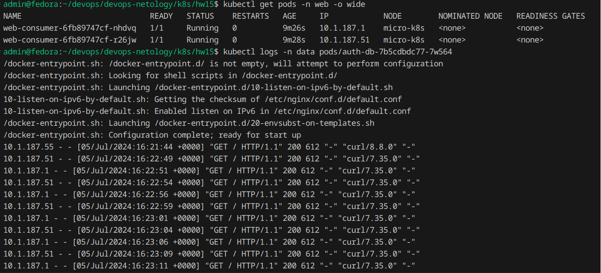

# Домашнее задание к занятию Troubleshooting

### Цель задания

Устранить неисправности при деплое приложения.

### Чеклист готовности к домашнему заданию

1. Кластер K8s.

### Задание. При деплое приложение web-consumer не может подключиться к auth-db. Необходимо это исправить

1. Установить приложение по команде:
```shell
kubectl apply -f https://raw.githubusercontent.com/netology-code/kuber-homeworks/main/3.5/files/task.yaml
```
2. Выявить проблему и описать.
3. Исправить проблему, описать, что сделано.
4. Продемонстрировать, что проблема решена.\

### Ответ:

Первая проблема, которая возникла при деплое - на кластере нет namespace `web` и `data`, что уже наводит на мысль что что-то не так.

Я создал необходимые namespace и задеплоися заново.

Обнаружил, что поды `web-consumer` ходят по сервису, который расположен в другом namespace.
Эту проблему можно решить двумя способами
- задеплоить все манифесты в один namespace
- указать поду `web-consumer` полное имя сервиса в формате FQDN: auth-db.data.svc.cluster.local

Я пошел по второму пути - [task-v2.yaml](task-v2.yaml)

После применения конфига, мы видим что все работает:



### Правила приёма работы

1. Домашняя работа оформляется в своём Git-репозитории в файле README.md. Выполненное домашнее задание пришлите ссылкой на .md-файл в вашем репозитории.
2. Файл README.md должен содержать скриншоты вывода необходимых команд, а также скриншоты результатов.
3. Репозиторий должен содержать тексты манифестов или ссылки на них в файле README.md.
