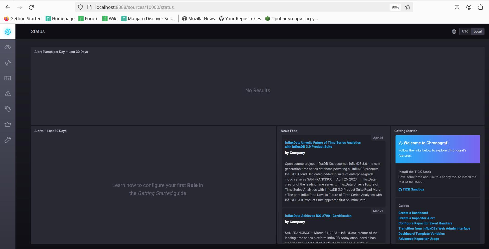
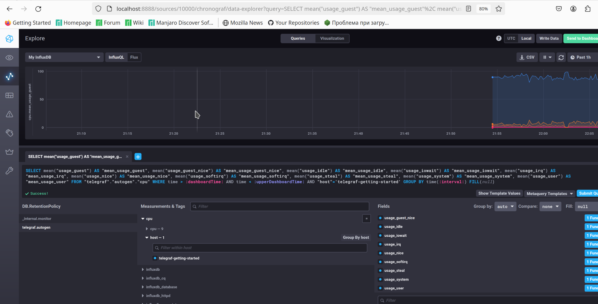
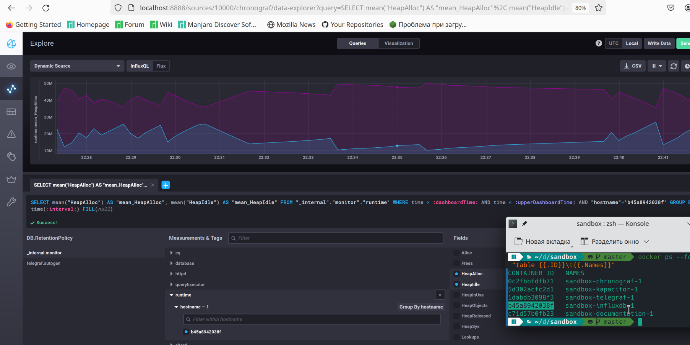

# Домашнее задание к занятию "13.Системы мониторинга"

## Обязательные задания

1. Вас пригласили настроить мониторинг на проект. На онбординге вам рассказали, что проект представляет из себя 
платформу для вычислений с выдачей текстовых отчетов, которые сохраняются на диск. Взаимодействие с платформой 
осуществляется по протоколу http. Также вам отметили, что вычисления загружают ЦПУ. Какой минимальный набор метрик вы
выведите в мониторинг и почему?
    ### Ответ:
      Необходиом следить за:
      - загрузкой CPU, так как вычисления грузят процессор
      - местом на диске, так как в перспективе отчеты забьют все место
      - inodes, так как большое количество созданных отчетов может привести к блокировке создания новых файлов
      - временем выполнения расчета, чтобы можно было прогнозировать нагрузку на систему в будущем
      - количеством запросов на расчет в единицу времени, также для прогноза
#
2. Менеджер продукта посмотрев на ваши метрики сказал, что ему непонятно что такое RAM/inodes/CPUla. Также он сказал, 
что хочет понимать, насколько мы выполняем свои обязанности перед клиентами и какое качество обслуживания. Что вы 
можете ему предложить?

    ### Ответ:
      Можно предложить обсудить уровень предоставления нашей услуги для клиентов - SLA

      SLA - договор, в котором клиенты и владельцы услуги описывают договоренности предосталвения услуги и санкции в случае нарушения SLA
      
      SLA - должен включать в себя SLO - уровень качества обслуживания, в котором прописываются ограничения на предоставление услуги.

      SLO же в свою очередь должен быть измеримым, в этом помогает SLI - конкретная величина качества
#
3. Вашей DevOps команде в этом году не выделили финансирование на построение системы сбора логов. Разработчики в свою 
очередь хотят видеть все ошибки, которые выдают их приложения. Какое решение вы можете предпринять в этой ситуации, 
чтобы разработчики получали ошибки приложения?

    ### Ответ:
      Компромиссным решением будет получить бесплатную облачную версию Sentry и настроить взаимодействие приложения с системой перехвата ошибок
#
4. Вы, как опытный SRE, сделали мониторинг, куда вывели отображения выполнения SLA=99% по http кодам ответов. 
Вычисляете этот параметр по следующей формуле: summ_2xx_requests/summ_all_requests. Данный параметр не поднимается выше 
70%, но при этом в вашей системе нет кодов ответа 5xx и 4xx. Где у вас ошибка?

    ### Ответ:
      Ошибка в формуле, не учитываются запросы с кодом 3хх

      Верная формула: (summ_2xx_requests + summ_2xx_requests) / summ_all_requests
#
5. Опишите основные плюсы и минусы pull и push систем мониторинга.
    ### Ответ:
      `pull`:
      - Плюсы:
        - легче контролировать подлинность данных
        - можно настроить единый proxy server до всех агентов с TLS
        - упрощённая отладка получения данных с агентов
      - Минусы:
        - падение в производительности доставки метрик tcp vs udp
        - сложности с репликацией метрик
      
      `push`:
      - Плюсы:
        - упрощение репликации данных в разные системы мониторинга или их резервные копии
        - более гибкая настройка отправки пакетов данных с метриками
        - UDP — это менее затратный способ передачи данных, из-за чего может возрасти производительность сбора метрик
      - Минусы:
        - Негарантированная доставка
        - Сложности с отладкой получения данных, монитоинг можешь показывать, что все хорошо, хотя метрики на самом деле не приходят
#
#
6. Какие из ниже перечисленных систем относятся к push модели, а какие к pull? А может есть гибридные?
   
    ### Ответ:
    - Prometheus - pull
    - TICK - push
    - Zabbix - гибрид
    - VictoriaMetrics - гибрид
    - Nagios - push
#
7. Склонируйте себе [репозиторий](https://github.com/influxdata/sandbox/tree/master) и запустите TICK-стэк, 
используя технологии docker и docker-compose.

В виде решения на это упражнение приведите скриншот веб-интерфейса ПО chronograf (`http://localhost:8888`). 

P.S.: если при запуске некоторые контейнеры будут падать с ошибкой - проставьте им режим `Z`, например
`./data:/var/lib:Z`


  ### Ответ:
  


#
8. Перейдите в веб-интерфейс Chronograf (http://localhost:8888) и откройте вкладку Data explorer.
        
    - Нажмите на кнопку Add a query
    - Изучите вывод интерфейса и выберите БД telegraf.autogen
    - В `measurments` выберите cpu->host->telegraf-getting-started, а в `fields` выберите usage_system. Внизу появится график утилизации cpu.
    - Вверху вы можете увидеть запрос, аналогичный SQL-синтаксису. Поэкспериментируйте с запросом, попробуйте изменить группировку и интервал наблюдений.

Для выполнения задания приведите скриншот с отображением метрик утилизации cpu из веб-интерфейса.


  ### Ответ:
  Судя по всему интерфейс обновили:
  
#
9. Изучите список [telegraf inputs](https://github.com/influxdata/telegraf/tree/master/plugins/inputs). 
Добавьте в конфигурацию telegraf следующий плагин - [docker](https://github.com/influxdata/telegraf/tree/master/plugins/inputs/docker):
```
[[inputs.docker]]
  endpoint = "unix:///var/run/docker.sock"
```

Дополнительно вам может потребоваться донастройка контейнера telegraf в `docker-compose.yml` дополнительного volume и 
режима privileged:
```
  telegraf:
    image: telegraf:1.4.0
    privileged: true
    volumes:
      - ./etc/telegraf.conf:/etc/telegraf/telegraf.conf:Z
      - /var/run/docker.sock:/var/run/docker.sock:Z
    links:
      - influxdb
    ports:
      - "8092:8092/udp"
      - "8094:8094"
      - "8125:8125/udp"
```

После настройке перезапустите telegraf, обновите веб интерфейс и приведите скриншотом список `measurments` в 
веб-интерфейсе базы telegraf.autogen . Там должны появиться метрики, связанные с docker.

Факультативно можете изучить какие метрики собирает telegraf после выполнения данного задания.

  ### Ответ:
  Судя по всему систему обновили так как:
  - сокет докера итак добавлен в docker-compose.yml - https://github.com/influxdata/sandbox/blob/master/docker-compose.yml
   - В конфигах telegraf есть inputs docker - https://github.com/influxdata/sandbox/blob/master/telegraf/telegraf.conf
  
  Смог найти в конфигах хост - докер контейнер с influxdb:
  
