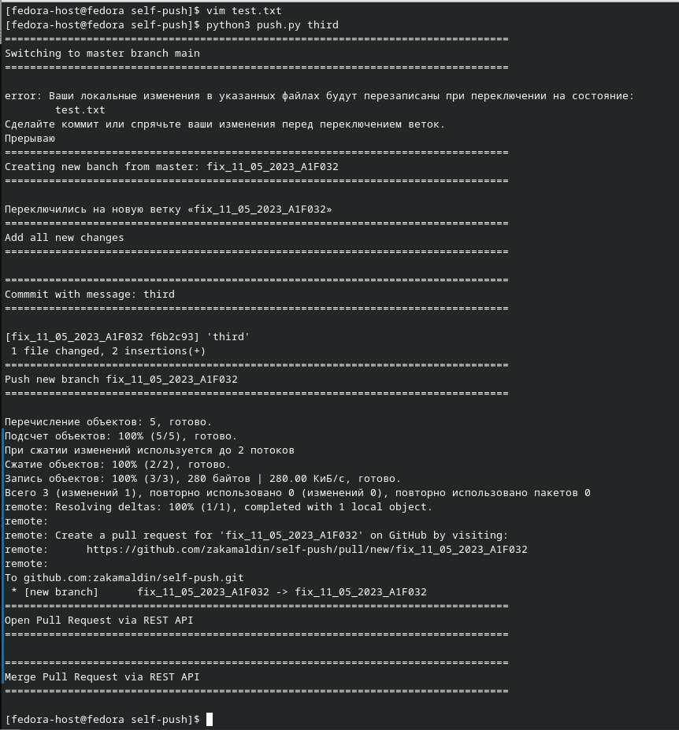

# Домашнее задание к занятию «Использование Python для решения типовых DevOps-задач»


## Задание 1

Есть скрипт:

```python
#!/usr/bin/env python3
a = 1
b = '2'
c = a + b
```

### Вопросы:

| Вопрос  | Ответ |
| ------------- | ------------- |
| Какое значение будет присвоено переменной `c`?  | Никакое, так как возникнет ошибка `TypeError: unsupported operand type(s) for +: 'int' and 'str'`  |
| Как получить для переменной `c` значение 12?  | Необходимо переменную `a` привести к типу `str`: c = str(a) + b  |
| Как получить для переменной `c` значение 3?  | Необходимо переменную `b` привести к типу `int`: c = a + int(b)  |

------

## Задание 2

Мы устроились на работу в компанию, где раньше уже был DevOps-инженер. Он написал скрипт, позволяющий узнать, какие файлы модифицированы в репозитории относительно локальных изменений. Этим скриптом недовольно начальство, потому что в его выводе есть не все изменённые файлы, а также непонятен полный путь к директории, где они находятся. 

Как можно доработать скрипт ниже, чтобы он исполнял требования вашего руководителя?

```python
#!/usr/bin/env python3

import os

bash_command = ["cd ~/netology/sysadm-homeworks", "git status"]
result_os = os.popen(' && '.join(bash_command)).read()
is_change = False
for result in result_os.split('\n'):
    if result.find('изменено') != -1:
        prepare_result = result.replace('\изменено:   ', '')
        print(prepare_result)
        break
```

### Ваш скрипт:

```python
#!/usr/bin/env python3

import os

bash_command = ["cd ~/netology/sysadm-homeworks", "git status"]
result_os = os.popen(' && '.join(bash_command)).read()
is_change = False
for result in result_os.split('\n'):
    if result.find('изменено') != -1:
        prepare_result = result.replace('\изменено:   ', '')
        print(prepare_result)
```

### Вывод скрипта при запуске во время тестирования:


------

## Задание 3

Доработать скрипт выше так, чтобы он не только мог проверять локальный репозиторий в текущей директории, но и умел воспринимать путь к репозиторию, который мы передаём, как входной параметр. Мы точно знаем, что начальство будет проверять работу этого скрипта в директориях, которые не являются локальными репозиториями.

### Ваш скрипт:

```python
#!/usr/bin/env python3

import os
import sys

working_directory = "~/netology/sysadm-homeworks"

if len(sys.argv) > 1:
    working_directory = sys.argv[1]
bash_command = [f"cd {working_directory}", "git status"]
result_os = os.popen(' && '.join(bash_command)).read()
is_change = False
for result in result_os.split('\n'):
    if result.find('изменено') != -1:
        prepare_result = result.replace('\tизменено:   ', '')
        print(prepare_result)
```

### Вывод скрипта при запуске во время тестирования:


------

## Задание 4

Наша команда разрабатывает несколько веб-сервисов, доступных по HTTPS. Мы точно знаем, что на их стенде нет никакой балансировки, кластеризации, за DNS прячется конкретный IP сервера, где установлен сервис. 

Проблема в том, что отдел, занимающийся нашей инфраструктурой, очень часто меняет нам сервера, поэтому IP меняются примерно раз в неделю, при этом сервисы сохраняют за собой DNS-имена. Это бы совсем никого не беспокоило, если бы несколько раз сервера не уезжали в такой сегмент сети нашей компании, который недоступен для разработчиков. 

Мы хотим написать скрипт, который: 

- опрашивает веб-сервисы; 
- получает их IP; 
- выводит информацию в стандартный вывод в виде: <URL сервиса> - <его IP>. 

Также должна быть реализована возможность проверки текущего IP сервиса c его IP из предыдущей проверки. Если проверка будет провалена — оповестить об этом в стандартный вывод сообщением: [ERROR] <URL сервиса> IP mismatch: <старый IP> <Новый IP>. Будем считать, что наша разработка реализовала сервисы: `drive.google.com`, `mail.google.com`, `google.com`.

### Ваш скрипт:

```python
#!/usr/bin/env python3

import socket
from time import sleep

hosts = {
    'drive.google.com':'',
    'mail.google.com': '',
    'google.com': '',
    'ya.ru': '' # добавил для наглядности, так как у гугловых адресов gethostbyname_ex возвращает 1 ip
    }

while True:
    for k, v in hosts.items():
        ip = socket.gethostbyname(k)
        if ip != v:
            print(f'[ERROR] {k} IP mismatch: {v} {ip}')
            hosts[k] = ip
        else:
            print(f'{k} {ip}')
        sleep(1)
```

### Вывод скрипта при запуске во время тестирования:


------

## Задание со звёздочкой* 

Это самостоятельное задание, его выполнение необязательно.
___

Так получилось, что мы очень часто вносим правки в конфигурацию своей системы прямо на сервере. Но так как вся наша команда разработки держит файлы конфигурации в GitHub и пользуется Gitflow, то нам приходится каждый раз: 

* переносить архив с нашими изменениями с сервера на наш локальный компьютер;
* формировать новую ветку; 
* коммитить в неё изменения; 
* создавать pull request (PR); 
* и только после выполнения Merge мы наконец можем официально подтвердить, что новая конфигурация применена. 

Мы хотим максимально автоматизировать всю цепочку действий. Для этого: 

1. Нужно написать скрипт, который будет в директории с локальным репозиторием обращаться по API к GitHub, создавать PR для вливания текущей выбранной ветки в master с сообщением, которое мы вписываем в первый параметр при обращении к py-файлу (сообщение не может быть пустым).
1. При желании можно добавить к указанному функционалу создание новой ветки, commit и push в неё изменений конфигурации. 
1. С директорией локального репозитория можно делать всё, что угодно. 
1. Также принимаем во внимание, что Merge Conflict у нас отсутствуют, и их точно не будет при push как в свою ветку, так и при слиянии в master. 

Важно получить конечный результат с созданным PR, в котором применяются наши изменения. 

### Ваш скрипт:

[Выложил в отдельный репозиторий](https://github.com/zakamaldin/self-push/blob/main/push.py)


### Вывод скрипта при запуске во время тестирования:



