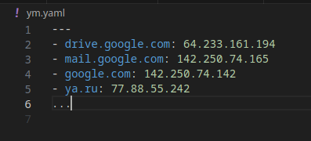

## Задание 1

Мы выгрузили JSON, который получили через API-запрос к нашему сервису:

```
    { "info" : "Sample JSON output from our service\t",
        "elements" :[
            { "name" : "first",
            "type" : "server",
            "ip" : 7175 
            }
            { "name" : "second",
            "type" : "proxy",
            "ip : 71.78.22.43
            }
        ]
    }
```
  Нужно найти и исправить все ошибки, которые допускает наш сервис.

### Ваш скрипт:

Убрал табуляцию
Добавил запятую между элементами массива
Добавил кавычки в ключе и значении ip второго элемента массива
```
    { "info" : "Sample JSON output from our service",
        "elements" :[
            { "name" : "first",
            "type" : "server",
            "ip" : 7175 
            },
            { "name" : "second",
            "type" : "proxy",
            "ip" : "71.78.22.43"
            }
        ]
    }
```

---

## Задание 2

В прошлый рабочий день мы создавали скрипт, позволяющий опрашивать веб-сервисы и получать их IP. К уже реализованному функционалу нам нужно добавить возможность записи JSON и YAML-файлов, описывающих наши сервисы. 

Формат записи JSON по одному сервису: `{ "имя сервиса" : "его IP"}`. 

Формат записи YAML по одному сервису: `- имя сервиса: его IP`. 

Если в момент исполнения скрипта меняется IP у сервиса — он должен так же поменяться в YAML и JSON-файле.

### Ваш скрипт:

```python
#!/usr/bin/env python3

import socket
from time import sleep
import json
import yaml

hosts = {
    'drive.google.com':'',
    'mail.google.com': '',
    'google.com': '',
    'ya.ru': '' # добавил для наглядности, так как у гугловых адресов gethostbyname_ex возвращает 1 ip
    }

while True:
    for k, v in hosts.items():
        ip = socket.gethostbyname(k)
        if ip != v:
            print(f'[ERROR] {k} IP mismatch: {v} {ip}')
            hosts[k] = ip
        else:
            print(f'{k} {ip}')
        sleep(1)
```

### Вывод скрипта при запуске во время тестирования:


### JSON-файл(ы), который(е) записал ваш скрипт:


### YAML-файл(ы), который(е) записал ваш скрипт:


