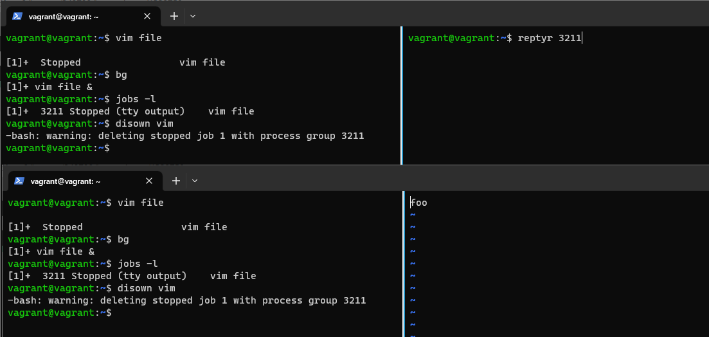

# Домашнее задание к занятию "Работа в терминале. Лекция 2"

1. Какого типа команда `cd`? Попробуйте объяснить, почему она именно такого типа: опишите ход своих мыслей, если считаете, что она могла бы быть другого типа.

    ### Ответ:

    `cd` - это встроенная в shell команда для осуществления смены текущей директории. 
    
    Мне кажется если бы команда была внешней, то она не могла бы передать в shell действие по смене текущей директории о чем говорит [эта статья](https://unix.stackexchange.com/questions/38808/why-is-cd-not-a-program)
3. Какая альтернатива без pipe команде `grep <some_string> <some_file> | wc -l`?
    
    ### Ответ:

    Вместо пайпа можно использовать ключ `-c` для `grep`

    ```bash
        grep log /var/log/syslog | wc -l
        2
        grep log /var/log/syslog -c
        2
    ```

    
3. Какой процесс с PID `1` является родителем для всех процессов в вашей виртуальной машине Ubuntu 20.04?

    ### Ответ:
    
    Процесс init
    ```bash
        ps 1
        PID TTY      STAT   TIME COMMAND
        1 ?        Ss     0:12 /sbin/init
    ```
4. Как будет выглядеть команда, которая перенаправит вывод stderr `ls` на другую сессию терминала?
    ### Ответ:    
    ```bash
     ls ... 2> /dev/pts/1
     ```
    

5. Получится ли одновременно передать команде файл на stdin и вывести ее stdout в другой файл? Приведите работающий пример.
    ### Ответ:    
    ```bash
     cat < file 1 > another_file
     ```
    


6. Получится ли, находясь в графическом режиме, вывести данные из PTY в какой-либо из эмуляторов TTY? Сможете ли вы наблюдать выводимые данные?
    ### Ответ: 
    Да, получилось:

    

7. Выполните команду `bash 5>&1`. К чему она приведет? Что будет, если вы выполните `echo netology > /proc/$$/fd/5`? Почему так происходит?

    ### Ответ: 
    `bash 5>&1` - создает дополнительный дескриптор для оболочики `bash`

    `echo netology > /proc/$$/fd/5` - записывает `netology`  в новый файловый дескриптор, который связан с текущим псевдо-терминалом

    


8. Получится ли в качестве входного потока для pipe использовать только stderr команды, не потеряв при этом отображение stdout на pty?  
	Необходимо:
    * создать новый дескриптор с номером 3 и перенаправить его вывод в поток вывода 1(stdout)- `3>&1`
    * перенаправить поток вывода 1(stdout) в поток ошибок 2(stderr) - `1>&2`
    * перенаправить поток ошибок 2(stderr) в дескрипто 3, то есть теперь в stdout - `2>&3`

    


9. Что выведет команда `cat /proc/$$/environ`? Как еще можно получить аналогичный по содержанию вывод?

    ### Ответ: 

    Будут выведены все переменные окружения, их также можно получит выполнив команду `env`
10. Используя `man`, опишите что доступно по адресам `/proc/<PID>/cmdline`, `/proc/<PID>/exe`.
    
    ### Ответ: 
    `/proc/<PID>/cmdline` - в этом файле содержится полная командная строка запуска процесса с номером PID
    
    `/proc/<PID>/exe` - символическая ссылка на исполняемый файл, с помощью которого запущен процесс под номером PID

11. Узнайте, какую наиболее старшую версию набора инструкций SSE поддерживает ваш процессор с помощью `/proc/cpuinfo`.
    ### Ответ:   

    Судя по выводу команды, наиболее старшая версия инструкций SSE - SSE4A, так как ВМ развернута на хосте с процессором от AMD

    

12. При открытии нового окна терминала и `vagrant ssh` создается новая сессия и выделяется pty.  
	Это можно подтвердить командой `tty`, которая упоминалась в лекции 3.2.  
	Однако:

    ```bash
	vagrant@netology1:~$ ssh localhost 'tty'
	not a tty
    ```

	Почитайте, почему так происходит, и как изменить поведение.
    
    ### Ответ:

    Это происходит потому команда вида `ssh host command` выполняет команду на удаленной машине без выделения отдельного терминала для удаленной сессии.

    Для изменения поведения необходимо добавить ключ `-t`:

    
    
13. Бывает, что есть необходимость переместить запущенный процесс из одной сессии в другую. Попробуйте сделать это, воспользовавшись `reptyr`. Например, так можно перенести в `screen` процесс, который вы запустили по ошибке в обычной SSH-сессии.

    ### Ответ: 
    Да, получилось, но необходимо было выполнить команду `sudo echo 0 | sudo tee /proc/sys/kernel/yama/ptrace_scope` из следующего задания:

    
14. `sudo echo string > /root/new_file` не даст выполнить перенаправление под обычным пользователем, так как перенаправлением занимается процесс shell'а, который запущен без `sudo` под вашим пользователем. Для решения данной проблемы можно использовать конструкцию `echo string | sudo tee /root/new_file`. Узнайте? что делает команда `tee` и почему в отличие от `sudo echo` команда с `sudo tee` будет работать.

    ### Ответ: 
    `sudo echo string > /root/new_file` не работает так как перенаправление потока через `>` происходит раньше выполнения команды `sudo echo` а выполнение команд чреез пайп `|` и `tee` происходит последовательно. Подобнее [тут](https://unix.stackexchange.com/questions/464652/is-there-any-difference-between-tee-and-when-using-echo).
