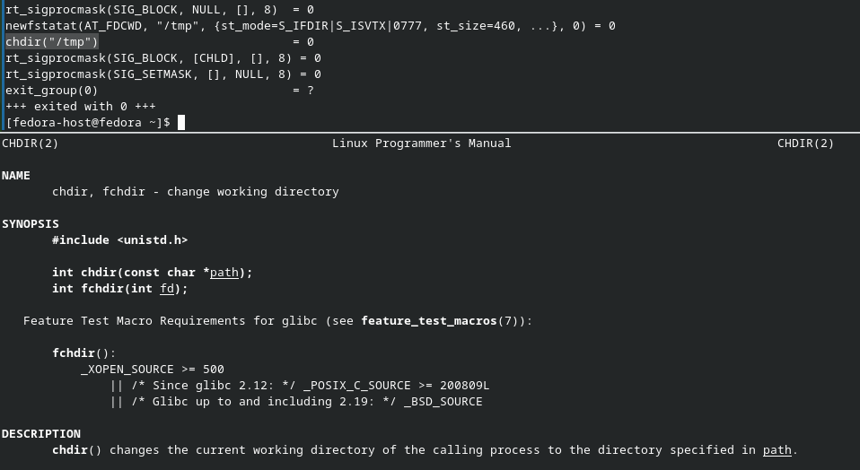
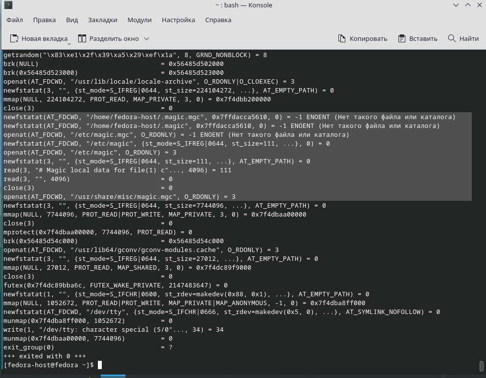
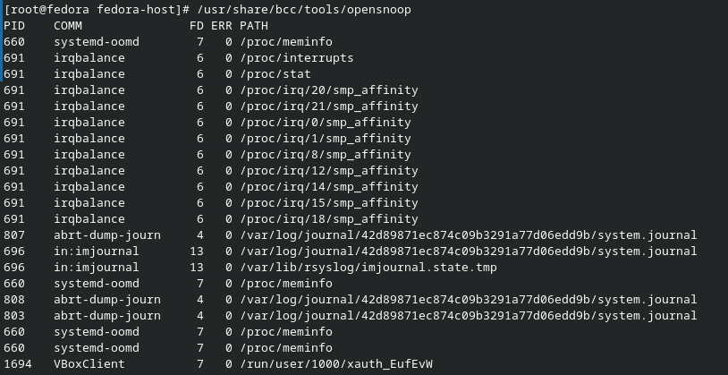
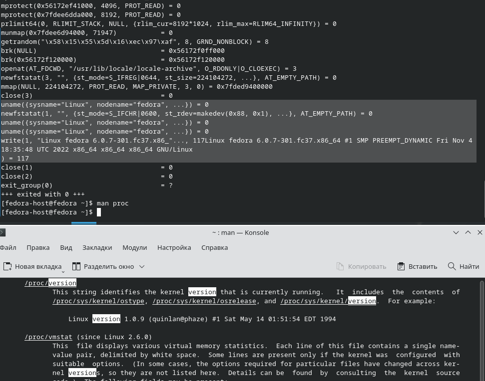

# Домашнее задание к занятию "Операционные системы. Лекция 1"

## Задание

1. Какой системный вызов делает команда `cd`? 
 
    ### Ответ:
 
    За смену директории отвечает ситсемный вызов `chdir(path)`
    
    
    

2. Попробуйте использовать команду `file` на объекты разных типов в файловой системе. Например:
    ```bash
    vagrant@netology1:~$ file /dev/tty
    /dev/tty: character special (5/0)
    vagrant@netology1:~$ file /dev/sda
    /dev/sda: block special (8/0)
    vagrant@netology1:~$ file /bin/bash
    /bin/bash: ELF 64-bit LSB shared object, x86-64
    ```
    Используя `strace` выясните, где находится база данных `file`, на основании которой она делает свои догадки.

    ### Ответ:

    Команда `file` в качестве базы данных использует "magic"-файл
    
    В `man file` также упоминается данный файл

    

3. Предположим, приложение пишет лог в текстовый файл. Этот файл оказался удален (deleted в lsof), однако возможности сигналом сказать приложению переоткрыть файлы или просто перезапустить приложение – нет. Так как приложение продолжает писать в удаленный файл, место на диске постепенно заканчивается. Основываясь на знаниях о перенаправлении потоков предложите способ обнуления открытого удаленного файла (чтобы освободить место на файловой системе).

    ### Ответ:

    Чтобы обнулить файл который удерживает процесс необходимо выполнить

    `> /proc/XXX/fd/YYY`, где
    
    `XXX`- PID процесса, который держит файл, можно посмотреть через `lsof -nP | grep '(deleted)'`
    
    `YYY` - номер файлового дескрипторы, который пишет данные в файл

    Однако это решение не избавляет от проблемы удаленного фалйа до следующего перезапуска приложения

    Есть способ подцепиться к работающему процессу и закрыть дескриптор и открыть новый [тут](https://stackoverflow.com/questions/1323956/how-to-redirect-output-of-an-already-running-process) и [тут](https://stackoverflow.com/questions/593724/redirect-stderr-stdout-of-a-process-after-its-been-started-using-command-lin)


4. Занимают ли зомби-процессы какие-то ресурсы в ОС (CPU, RAM, IO)?

    ### Ответ:

    Нет, так как такой процесс уже вызвал команду exit() и освободил ресурсы.

5. В iovisor BCC есть утилита `opensnoop`:
    ```bash
    root@vagrant:~# dpkg -L bpfcc-tools | grep sbin/opensnoop
    /usr/sbin/opensnoop-bpfcc
    ```
    На какие файлы вы увидели вызовы группы `open` за первую секунду работы утилиты? Воспользуйтесь пакетом `bpfcc-tools` для Ubuntu 20.04. Дополнительные [сведения по установке](https://github.com/iovisor/bcc/blob/master/INSTALL.md).

    ### Ответ:

    Результат выполнения strace показал, что при запуске утилиты `opensnoop` происходит подключение библиотеки libc для вызова API ядра и библиотек для запуска интерпретатора python

    Если говорить о выводе самой утилиты, то она регистрирует открытия следующих файлов:

    


6. Какой системный вызов использует `uname -a`? Приведите цитату из man по этому системному вызову, где описывается альтернативное местоположение в `/proc`, где можно узнать версию ядра и релиз ОС.
 
    ### Ответ:
 
    Команда `uname -a` использует системный вызов `uname()`.

    Также информацию о версии ядра можно получить из `/proc/varsion`
    
    
7. Чем отличается последовательность команд через `;` и через `&&` в bash? Например:
    ```bash
    root@netology1:~# test -d /tmp/some_dir; echo Hi
    Hi
    root@netology1:~# test -d /tmp/some_dir && echo Hi
    root@netology1:~#
    ```
    Есть ли смысл использовать в bash `&&`, если применить `set -e`?

    ### Ответ:

    В первом случае (`;`) - команды выполнятся последовательно вне зависимотси от результата выполнения каждой

    Во втором случае (`&&`) - команды выполнятся последовательно только если результат выполнения предыдущей был успешен, то есть exit код = 0

    Режим `/bin/bash -e` устанавливает зависимость пайплайном между собой, если в результате выполнения цепочки пайплайнов exit код != 0, то выполнение останавливается, что мы и наблюдаем при вором запуске. Команда `test -d /tmp/some_dir` выполнилась с ошибкой и дальнейшее выполнения команд в цепочке прервано

    Подробнее [тут](https://stackoverflow.com/questions/9952177/whats-the-meaning-of-the-parameter-e-for-bash-shell-command-line)


8. Из каких опций состоит режим bash `set -euxo pipefail` и почему его хорошо было бы использовать в сценариях?

    ### Ответ:

    * `-e` - см предыдущий ответ
    * `-u` - Считать неустановленные переменные ошибкой при подстановке.
    * `-x` - Печатать команды и их аргументы по мере их выполнения.
    * `-o pipefail` - возвращаемое значение конвейера — это статус последней команды с ненулевым статусом, или ноль, если ни одна команда не завершилась с ненулевым статусом

    Эти опции полезно использовать в сценариях для отладки и защиты от некорректного исполнения.

9. Используя `-o stat` для `ps`, определите, какой наиболее часто встречающийся статус у процессов в системе. В `man ps` ознакомьтесь (`/PROCESS STATE CODES`) что значат дополнительные к основной заглавной буквы статуса процессов. Его можно не учитывать при расчете (считать S, Ss или Ssl равнозначными).

    ### Ответ:

    Большинство процессов в системе находится в состоянии сна(ожидает выполнения) - S