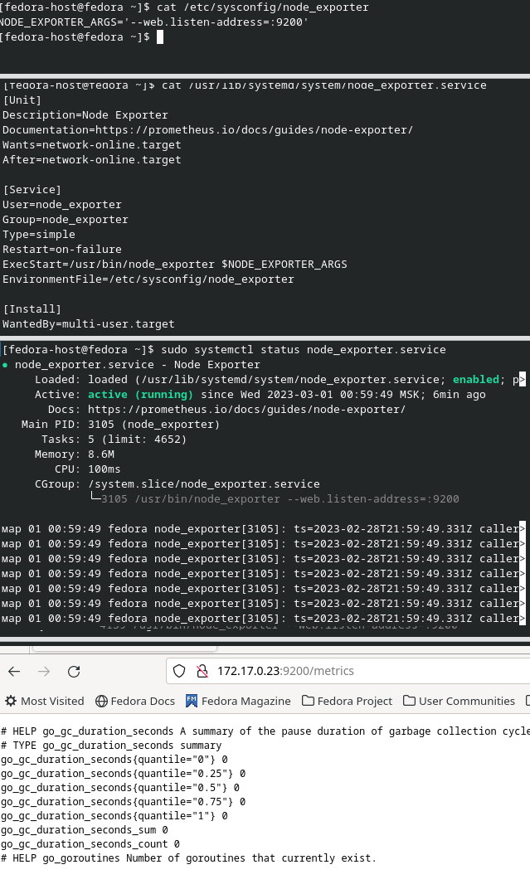

# Домашнее задание к занятию «Операционные системы. Лекция 2»

## Задание

1. На лекции вы познакомились с [node_exporter](https://github.com/prometheus/node_exporter/releases). В демонстрации его исполняемый файл запускался в background. Этого достаточно для демо, но не для настоящей production-системы, где процессы должны находиться под внешним управлением. Используя знания из лекции по systemd, создайте самостоятельно простой [unit-файл](https://www.freedesktop.org/software/systemd/man/systemd.service.html) для node_exporter:

    ### Ответ:
    
    Получилось, на скриншоте привел информацию о:

    * файле конфигурации для юнита
    * файл юнита
    * статус сервиса
    * доступность node_exporter по выставленному порту из конфигов

    

2. Изучите опции node_exporter и вывод `/metrics` по умолчанию. Приведите несколько опций, которые вы бы выбрали для базового мониторинга хоста по CPU, памяти, диску и сети.
    
    ### Ответ:

    * по CPU - node_cpu_seconds_total
    * по памяти:
      * node_memory_MemTotal_bytes
      * node_memory_MemFree_bytes
      * node_memory_MemAvailable_bytes
      * node_memory_Buffers_bytes
      * node_memory_Cached_bytes
    * по диску - группа метрик node_filesystem*
    * по сети:
      * node_network_receive_bytes_total
      * node_network_transmit_bytes_total
      * node_network_speed_bytes

3. Установите в свою виртуальную машину Netdata.

    ### Ответ:
 
    `sudo yum install netdata`
    
    

4. Можно ли по выводу `dmesg` понять, осознаёт ли ОС, что загружена не на настоящем оборудовании, а на системе виртуализации?

    ### Ответ:

    Да, выполнив команду `dmesg | grep Hypervisor`
    
    

5. Как настроен sysctl `fs.nr_open` на системе по умолчанию? Определите, что означает этот параметр. Какой другой существующий лимит не позволит достичь такого числа (`ulimit --help`)?

    ### Ответ:

    `fs.nr_open` - системное ограничение на количество открытых дескрипторов = 1073741816
    `ulimit -n` - показывает "мягкое" ограничение в 1024 открытых файла, можно увеличить до значения "жесткого" ограничения
    `ulimit -n -H` - показывает "жесткое" ограничение в 4096 открытых файла

    P.S.:
    Также можно задать ограничение можно в `/etc/security/limits.conf` значением `nofile`

6. Запустите любой долгоживущий процесс (не `ls`, который отработает мгновенно, а, например, `sleep 1h`) в отдельном неймспейсе процессов; покажите, что ваш процесс работает под PID 1 через `nsenter`. Для простоты работайте в этом задании под root (`sudo -i`). Под обычным пользователем требуются дополнительные опции (`--map-root-user`) и т. д.

    ### Ответ:

    Выполнил для `/usr/bin/top`:
    
    

7. Найдите информацию о том, что такое `:(){ :|:& };:`. Запустите эту команду в своей виртуальной машине Vagrant с Ubuntu 20.04 (**это важно, поведение в других ОС не проверялось**). Некоторое время всё будет плохо, после чего (спустя минуты) — ОС должна стабилизироваться. Вызов `dmesg` расскажет, какой механизм помог автоматической стабилизации. Как настроен этот механизм по умолчанию, и как изменить число процессов, которое можно создать в сессии?
    
    ### Ответ:

    `:(){ :|:& };:` - реккурсивная функция(форк-бомба), которая порождает два дочерних процесса-клона и так далее пока не закончится вся выделенная оперативная память
    
    Форк-бобма при запуске дочерних процессов достигла лимита на максимальное количество процессов `ulimit -u`.

    Увеличить значение можно добавив строчку `* hard nproc 12345` в `sudo vim /etc/security/limits.conf` и перезапусить систему.

    Если форк-бомба сможет создать настолько большое количество процессов, что потратит всю выделенную паять, процесс ООМ(Out-Of-Memory)-Killer убьет процесс форк-бобмы.

    Данный механизм ядра Linux предназнаяен для предотвращения проблем с недостатком памяти.

    У каждого процесса есть счетчик очков приоритета на удаление, по умолчанию OOM-Killer будет закрывть наименее важный процесс. 

    На это поведение можно повлиять изменив приоритет удаления, как сказано [тут](https://interface31.ru/tech_it/2022/09/linux---nachinayushhim-chto-takoe-oom-killer-i-kak-on-rabotaet.html) и [тут](http://geckich.blogspot.com/2013/12/linux-out-of-memory-killer-oom.html)
