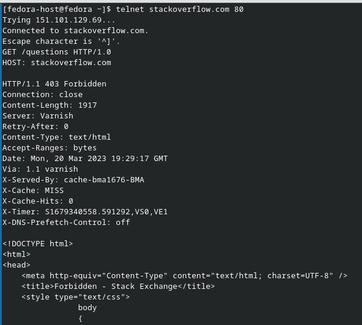
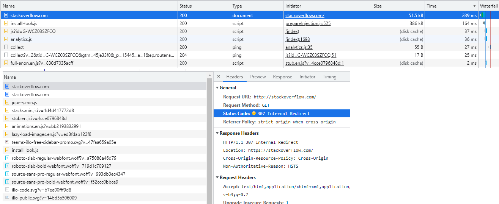
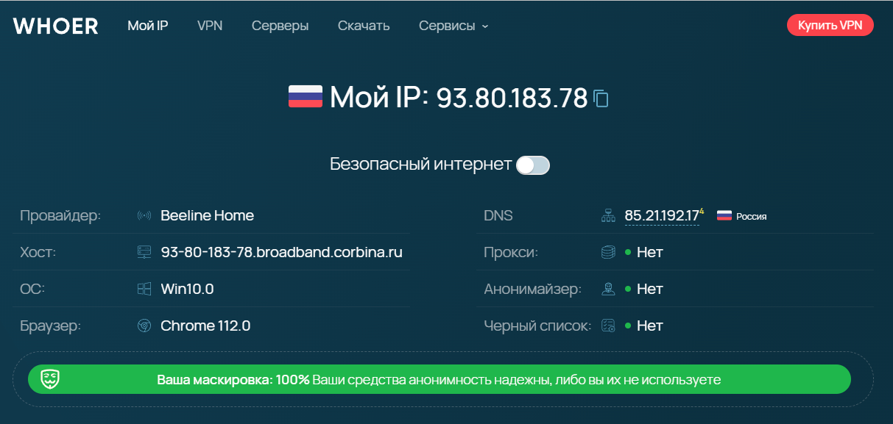
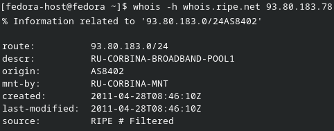
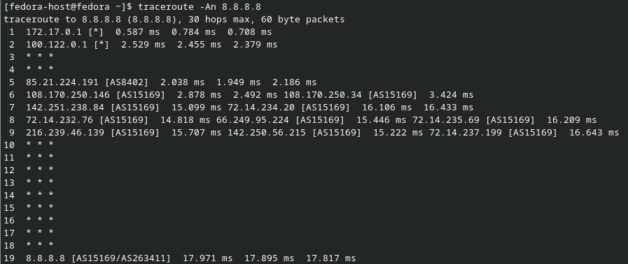
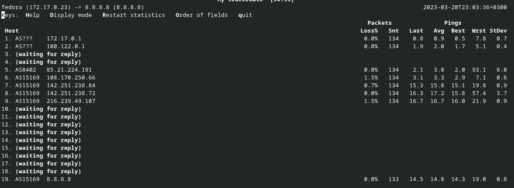
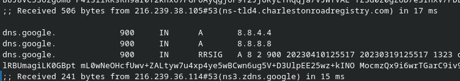
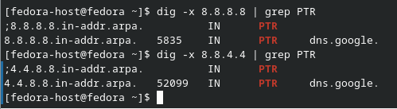

# Домашнее задание к занятию «Компьютерные сети. Лекция 1»

## Задание

**Шаг 1.** Работа c HTTP через telnet.

- Подключитесь утилитой telnet к сайту stackoverflow.com
- Eкажите полученный HTTP-код и поясните, что он означает

### Ответ:

Получили 403 - отказ в доступе 

**Шаг 2.** Повторите задание 1 в браузере, используя консоль разработчика F12:
    
### Ответ:

Первый ответ http-сервера - это редирект на https с кодом 307

**Шаг 3.** Какой IP-адрес у вас в интернете?

### Ответ:

**Шаг 4.** Какому провайдеру принадлежит ваш IP-адрес? Какой автономной системе AS? Воспользуйтесь утилитой `whois`.

### Ответ:

Провайдер BeeLine(Corbina) AS8402

**Шаг 5.** Через какие сети проходит пакет, отправленный с вашего компьютера на адрес 8.8.8.8? Через какие AS? Воспользуйтесь утилитой `traceroute`.

### Ответ:

**Шаг 6.** Повторите задание 5 в утилите `mtr`. На каком участке наибольшая задержка — delay?

### Ответ:

Самая большая задержка на на участке AS8402 - на провайдере

**Шаг 7.** Какие DNS-сервера отвечают за доменное имя dns.google? Какие A-записи? Воспользуйтесь утилитой `dig`.

### Ответ:

За доменное имя `dns.google` отвечают следующие А-записи:

* 8.8.4.4
* 8.8.8.8

Результат выполнения `gid +trace dns.google`

**Шаг 8.** Проверьте PTR записи для IP-адресов из задания 7. Какое доменное имя привязано к IP? Воспользуйтесь утилитой `dig`.

### Ответ:
