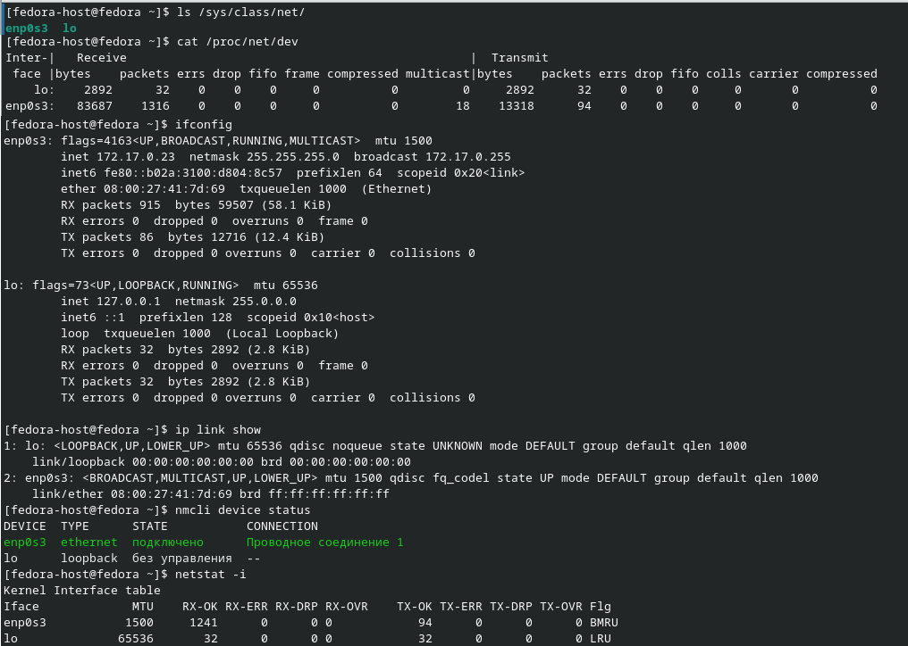
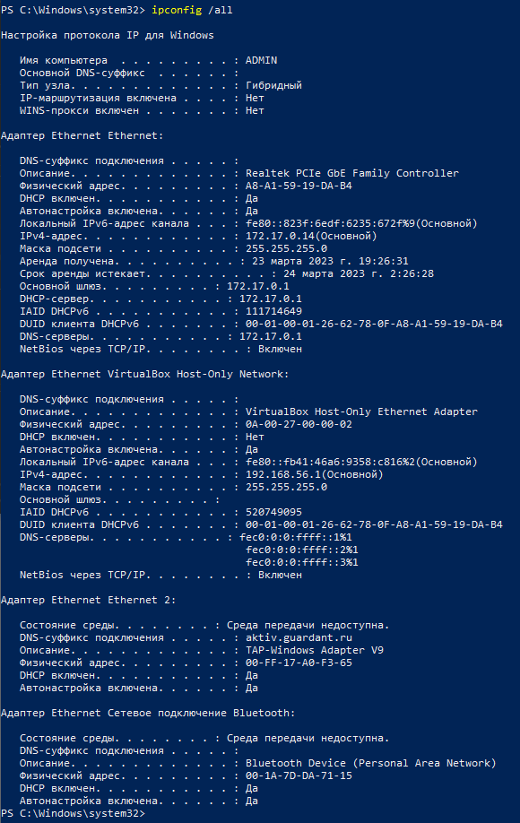
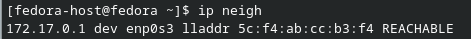
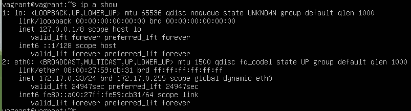
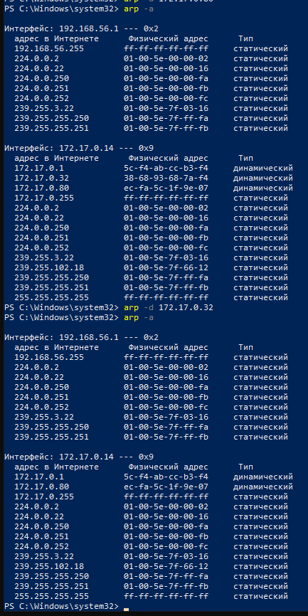

# Домашнее задание к занятию «Компьютерные сети. Лекция 2»

## Задание

1. Проверьте список доступных сетевых интерфейсов на вашем компьютере. Какие команды есть для этого в Linux и в Windows?

    ### Ответ:

    Способы в Linux:
    * Директория /sys/class/net
    * Файл /proc/net/dev 
    * Утилита ifconfig
    * Утилита ip
    * Утилита nmcli
    * Утилита netstat

    

    Способы в Linux:
    * Утилита ipconfig 

    


2. Какой протокол используется для распознавания соседа по сетевому интерфейсу? Какой пакет и команды есть в Linux для этого?

    ### Ответ:
    Для распознавания соседей используется пакет `ip`(команда `ip neigh`)

    

3. Какая технология используется для разделения L2-коммутатора на несколько виртуальных сетей? Какой пакет и команды есть в Linux для этого? Приведите пример конфига.

    ### Ответ:
    Для такого разделения используется технология `VLAN` - виртуальная сеть, привязанная к одному из портов L2-коммутатора(1 порт = 1 сеть).
    
    В Linux используется пакет `vlan`

    Конфиг(мануалы говорят, что надо настроить vlan еще на роутере, тогда будет работать):
    `/etc/network/interfaces`
    ```
    auto netology_vlan
    iface netology_vlan inet static
    address 172.17.0.33
    netmask 255.255.255.0
    vlan_raw_device eth0
    ```

    

4. Какие типы агрегации интерфейсов есть в Linux? Какие опции есть для балансировки нагрузки? Приведите пример конфига.

    ### Ответ:

    Есть 7 типов агрегации сетевых интерфейсов(bonding):

    1. Mode-0(balance-rr) - балансировка по кругу, поочередная отправка сетевых пакетов на сетевые интерфейсы в пуле
    2. Mode-1(active-backup) - 1 активный интерфейс, остальные в резерве. При проблемах на активном интерфейсе он выключается из аггрегации и активным становится один из резервных
    3. Mode-2(balance-xor) - 1 интерфейс назначется одному получателю, за счт чего удается получить балансировку и повыситт отказоустойчивость
    4. Mode-3(broadcast) - отправка сетевых пакетов на все интерфейсы в пуле, рекомендовано для MULTICAST-трафика
    5. Mode-4(802.3ad) - динамическое объединение портов
    6. Mode-5(balance-tlb) - адаптивная балансировка исходящего трафика
    7. Mode-6(balance-alb) - адаптивная балансировка входящего и исходящего трафика

    Пример конфига `/etc/network/interfaces`:
    ```
    iface bond0 inet static
    address 172.17.0.33
    netmask 255.255.255.0
    network 172.17.0.0
    gateway 172.17.0.1
    bond_mode balance-tlb
    bond_miimon 100
    bond_downdelay 200
    bond_updelay 200
    slaves eth0 eth1
    ```

5. Сколько IP-адресов в сети с маской /29 ? Сколько /29 подсетей можно получить из сети с маской /24. Приведите несколько примеров /29 подсетей внутри сети 10.10.10.0/24.
 
    ### Ответ:

    * в сети с маской /29 8 IP-адресов, 1 адрес сети, 1 широковещательный и 6
    * в сети с маской /24 есть 2^8(количество свободных бит) = 256 IP-адреса, маска /29 вмещает в себя 8 IP-адресов(п.1), следовательно в сеть с маской /24 влезает 32 подсети с маской /29
    * Примеры:
      * 10.10.10.0/29 - адрес сети, 10.10.10.7 - широковещательный, 6 свободных хостов
      * 10.10.10.8/29 - адрес сети, 10.10.10.15 - широковещательный, 6 свободных хостов
      * 10.10.10.16/29 - адрес сети, 10.10.10.23 - широковещательный, 6 свободных хостов

6. Задача: вас попросили организовать стык между двумя организациями. Диапазоны 10.0.0.0/8, 172.16.0.0/12, 192.168.0.0/16 уже заняты. Из какой подсети допустимо взять частные IP-адреса? Маску выберите из расчёта — максимум 40–50 хостов внутри подсети.

    ### Ответ:
    Полагаю, что из доступных общепринятых частных сетей для такой задачи подойдет сеть используемая провайдерами - 100.64.0.0 с маской /26
    100.64.0.0/26 за исключением адреса котоорый нам выдал провайдер + необходимы правила мршрутизации. чтобы при отправке сетевых пакетов в эту подсеть, пакеты не пытались уйти за NAT


7. Как проверить ARP-таблицу в Linux, Windows? Как очистить ARP-кеш полностью? Как из ARP-таблицы удалить только один нужный IP?

    ### Ответ:
    
    * Поверка для Windoiws и Linux не отличается: `arp -a`
    * Очистка кэша:
      * Windows: `arp -d`
      * Linux: `ip -s -s neigh flush all`
    * Удаление конкретного адреса для Windoiws и Linux не отличается: `arp -d ip_addr`
    
    