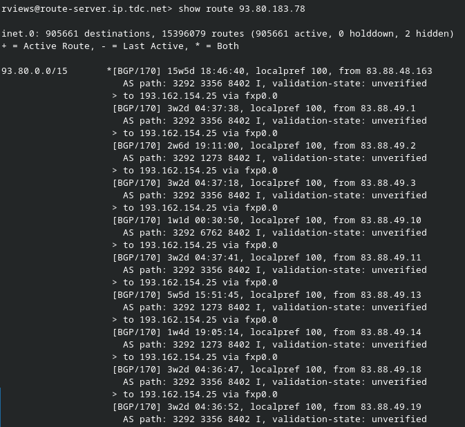
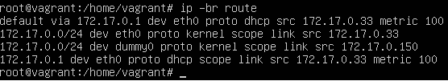
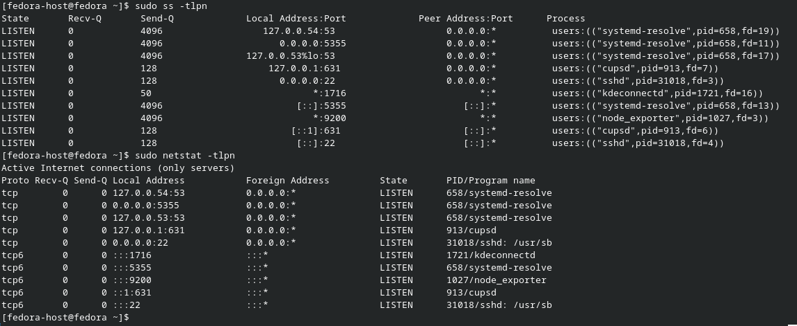
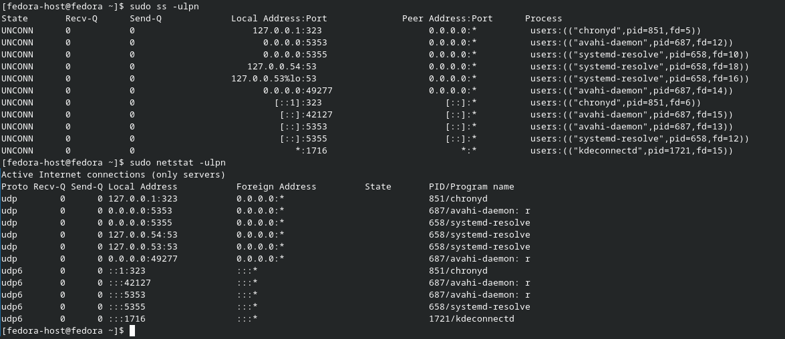
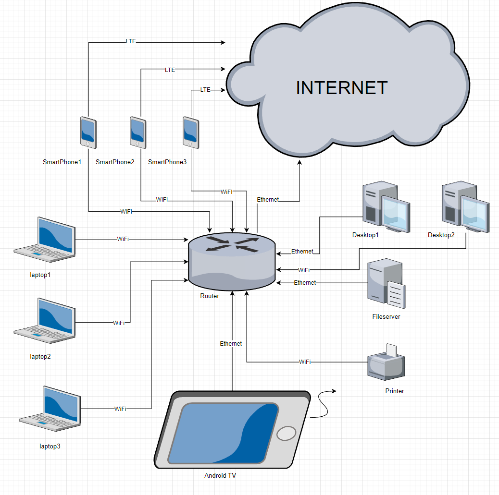

# Домашнее задание к занятию «Компьютерные сети. Лекция 3»

## Задание

1. Подключитесь к публичному маршрутизатору в интернет. Найдите маршрут к вашему публичному IP.

    ### Ответ:

    Нашел список серверов [тут](https://www.routeservers.org/)

    Подключился к `telnet://route-server.ip.tdc.net`

    К сожалению, из всех команд группы `bgp` доступна только `summary`, 
    
    а `show route x.x.x.x` особо не дала результата:

    


2. Создайте dummy-интерфейс в Ubuntu. Добавьте несколько статических маршрутов. Проверьте таблицу маршрутизации.

    ### Ответ:

    ```
    modprobe -v dummy numdummies=2
    ip addr add 172.17.0.150/24 dev dummy0
    ip link add dummy0 type dummy
    ip link set dummy0 up
    ip route add 172.17.0.150 dev dummy0
    ```


    

3. Проверьте открытые TCP-порты в Ubuntu. Какие протоколы и приложения используют эти порты? Приведите несколько примеров.

    

4. Проверьте используемые UDP-сокеты в Ubuntu. Какие протоколы и приложения используют эти порты?

    

5. Используя diagrams.net, создайте L3-диаграмму вашей домашней сети или любой другой сети, с которой вы работали. 

    


