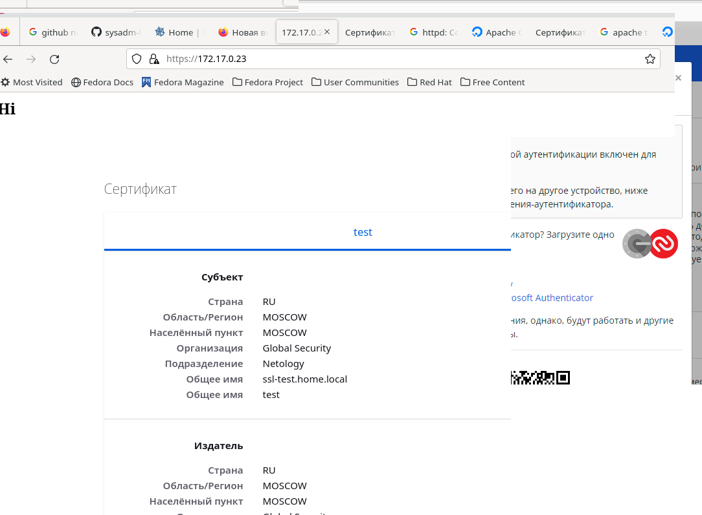

# Домашнее задание к занятию «Элементы безопасности информационных систем»

## Задание

1. Установите плагин Bitwarden для браузера. Зарегестрируйтесь и сохраните несколько паролей.

    ### Ответ:

    

2. Установите Google Authenticator на мобильный телефон. Настройте вход в Bitwarden-акаунт через Google Authenticator OTP.

    ### Ответ:

    

3. Установите apache2, сгенерируйте самоподписанный сертификат, настройте тестовый сайт для работы по HTTPS.

    ### Ответ:

    

4. Проверьте на TLS-уязвимости произвольный сайт в интернете (кроме сайтов МВД, ФСБ, МинОбр, НацБанк, РосКосмос, РосАтом, РосНАНО и любых госкомпаний, объектов КИИ, ВПК и т. п.).
 
    ### Ответ:

    

5. Установите на Ubuntu SSH-сервер, сгенерируйте новый приватный ключ. Скопируйте свой публичный ключ на другой сервер. Подключитесь к серверу по SSH-ключу.
 
    ### Ответ:

    

6. Переименуйте файлы ключей из задания 5. Настройте файл конфигурации SSH-клиента так, чтобы вход на удалённый сервер осуществлялся по имени сервера.
 
    ### Ответ:

    

7. Соберите дамп трафика утилитой tcpdump в формате pcap, 100 пакетов. Откройте файл pcap в Wireshark.
 
    ### Ответ:

    
