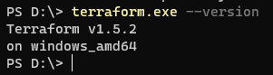

# Домашнее задание к занятию «Введение в Terraform»

### Цель задания

1. Установить и настроить Terrafrom.
2. Научиться использовать готовый код.

------

### Чеклист готовности к домашнему заданию

1. Скачайте и установите актуальную версию **terraform** >=1.4.X . Приложите скриншот вывода команды ```terraform --version```.
2. Скачайте на свой ПК данный git репозиторий. Исходный код для выполнения задания расположен в директории **01/src**.
3. Убедитесь, что в вашей ОС установлен docker.

------


### Задание 1
0. Версия Terraform
    


1. Перейдите в каталог [**src**](https://github.com/netology-code/ter-homeworks/tree/main/01/src). Скачайте все необходимые зависимости, использованные в проекте. 
    ### Ответ:

    

2. Изучите файл **.gitignore**. В каком terraform файле согласно этому .gitignore допустимо сохранить личную, секретную информацию?
    ### Ответ:

    в файлах в именах которых есть `tfstate`и в `personal.auto.tfvars`

3. Выполните код проекта. Найдите  в State-файле секретное содержимое созданного ресурса **random_password**, пришлите в качестве ответа конкретный ключ и его значение.
    ### Ответ:
        "result": "GHNMWn4Wn5LfVFkg"

4. Раскомментируйте блок кода, примерно расположенный на строчках 29-42 файла **main.tf**.
Выполните команду ```terraform validate```. Объясните в чем заключаются намеренно допущенные ошибки? Исправьте их.
    
    ### Ответ:

    - Invalid resource name
        - Ошибка связана с некорректным именем ресурса, необходимо убрать `1` из `1nginx`
    - Reference to undeclared resource
        - В раскомментированных строках идет создание ресурса `"docker_container" "nginx"`, в описании котрого используются значения из другого ресурса, который осталсязакомментиован и не создался. Возникает оибка при обращении ресруса, который `terraform` еще не создал. Для исправления надо раскомментировать ресурс.
    - Missing name for resource
        - У ресурса `"docker_image"` не задано имя, надo проставить имя`"nginx"`, так как по этому имени идет обращение в последнем ресурсе
    - опять Reference to undeclared resource, но на другом ресурсе
      - на 31й строчке надо сменить имя ресурса `random_password.random_string_fake` -> `random_password.random_string`
    - Unsupported attribute
      - Опечатка при вызове аттрибута `resuld` -> `result`
    
5. Выполните код. В качестве ответа приложите вывод команды ```docker ps```
    ### Ответ:
    

6. Замените имя docker-контейнера в блоке кода на ```hello_world```, выполните команду ```terraform apply -auto-approve```.
Объясните своими словами, в чем может быть опасность применения ключа  ```-auto-approve``` ? В качестве ответа дополнительно приложите вывод команды ```docker ps```
    
    ### Ответ:
    Банально можно залить кривую инфраструктуру в облаков,  флаг снимает подтверждение пользователем, на скрине видно, что часть ресурсов будет удалена, а часть добавлена
    

7. Уничтожьте созданные ресурсы с помощью **terraform**. Убедитесь, что все ресурсы удалены. Приложите содержимое файла **terraform.tfstate**. 
    ### Ответ
    ```json
        {
        "version": 4,
        "terraform_version": "1.5.2",
        "serial": 11,
        "lineage": "74e2ff74-768c-896e-86c0-fa99f71503c6",
        "outputs": {},
        "resources": [],
        "check_results": null
       }

    ```

8. Объясните, почему при этом не был удален docker образ **nginx:latest** ? Ответ подкрепите выдержкой из документации провайдера.
    ### Ответ
    Образ не удалился так как мы указали в ресурсе параметр `keep_locally`:

        keep_locally (Boolean) If true, then the Docker image won't be deleted on destroy operation. If this is false, it will delete the image from the docker local storage on destroy operation

------

## Дополнительные задания (со звездочкой*)

**Настоятельно рекомендуем выполнять все задания под звёздочкой.**   Их выполнение поможет глубже разобраться в материале.   
Задания под звёздочкой дополнительные (необязательные к выполнению) и никак не повлияют на получение вами зачета по этому домашнему заданию. 

### Задание 2*

1. Изучите в документации provider [**Virtualbox**](https://docs.comcloud.xyz/providers/shekeriev/virtualbox/latest/docs) от 
shekeriev.
2. Создайте с его помощью любую виртуальную машину. Чтобы не использовать VPN советуем выбрать любой образ с расположением в github из [**списка**](https://www.vagrantbox.es/)

В качестве ответа приложите plan для создаваемого ресурса и скриншот созданного в VB ресурса. 

### Ответ:

