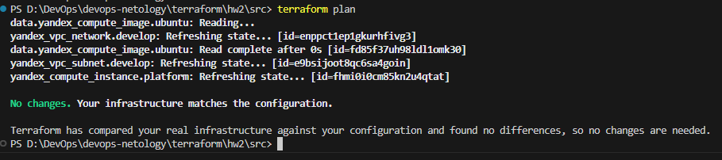
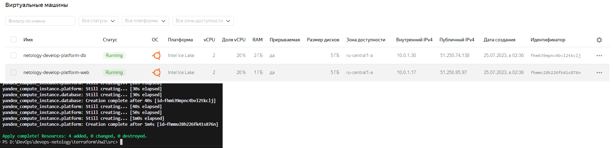
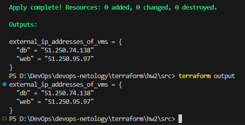
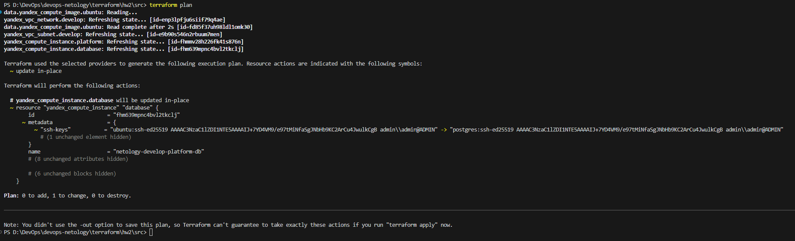

# Домашнее задание к занятию «Основы Terraform. Yandex Cloud»

### Задание 1
В качестве ответа всегда полностью прикладываете ваш terraform-код в git!

1. Изучите проект. В файле variables.tf объявлены переменные для yandex provider.
2. Переименуйте файл personal.auto.tfvars_example в personal.auto.tfvars. Заполните переменные (идентификаторы облака, токен доступа). Благодаря .gitignore этот файл не попадет в публичный репозиторий. **Вы можете выбрать иной способ безопасно передать секретные данные в terraform.**
3. Сгенерируйте или используйте свой текущий ssh ключ. Запишите его открытую часть в переменную **vms_ssh_root_key**.
4. Инициализируйте проект, выполните код. Исправьте намеренно допущенные синтаксические ошибки. Ищите внимательно, посимвольно. Ответьте в чем заключается их суть? 
5. Ответьте, как в процессе обучения могут пригодиться параметры```preemptible = true``` и ```core_fraction=5``` в параметрах ВМ? Ответ в документации Yandex cloud.

    ### Ответ:

    0. Закоммитил с комментарием "terraform_hw2_exercise_1"
    1. Изучил
    2. Переименовал и заполнил переменные
    3. Использовал свой ssh ключик, положил в `personal.auto.tfvars`
    4. Ошибки
       - `platform_id` - выбран идентификатор платформы не из перечня провайдера - https://cloud.yandex.ru/docs/compute/concepts/vm-platforms
       - `core_fraction` и `cores` - выбраны параметры не из перечня провайдера в зависимости от выбранной платформы - https://cloud.yandex.ru/docs/compute/concepts/performance-levels 
    5. Выставление обоих апраметров существенно снижает стоимость ВМ, а также
       - `preemptible = true` - делает ВМ прервываемой, что позволяет принудительно остановить ВМ при истечении 24х часов после запуска или если не хвататет ресрусов на запуск обычной ВМ в той же зоне доступности
       - `core_fraction` - уровень производительности, который определяет долю вычислительного времени физических ядер, которую гарантирует vCPU.
    

### Задание 2

1. Изучите файлы проекта.
2. Замените все "хардкод" **значения** для ресурсов **yandex_compute_image** и **yandex_compute_instance** на **отдельные** переменные. К названиям переменных ВМ добавьте в начало префикс **vm_web_** .  Пример: **vm_web_name**.
2. Объявите нужные переменные в файле variables.tf, обязательно указывайте тип переменной. Заполните их **default** прежними значениями из main.tf. 
3. Проверьте terraform plan (изменений быть не должно). 

    ### Ответ:
   
         Закоммитил с комментарием "terraform_hw2_exercise_2"
    

### Задание 3

1. Создайте в корне проекта файл 'vms_platform.tf' . Перенесите в него все переменные первой ВМ.
2. Скопируйте блок ресурса и создайте с его помощью вторую ВМ(в файле main.tf): **"netology-develop-platform-db"** ,  cores  = 2, memory = 2, core_fraction = 20. Объявите ее переменные с префиксом **vm_db_** в том же файле('vms_platform.tf').
3. Примените изменения.

    ### Ответ:
   
         Закоммитил с комментарием "terraform_hw2_exercise_3"
    

### Задание 4

1. Объявите в файле outputs.tf output типа map, содержащий { instance_name = external_ip } для каждой из ВМ.
2. Примените изменения.

   В качестве решения приложите вывод значений ip-адресов команды ```terraform output```

    ### Ответ:
   
         Закоммитил с комментарием "terraform_hw2_exercise_4"
    

### Задание 5

1. В файле locals.tf опишите в **одном** local-блоке имя каждой ВМ, используйте интерполяцию ${..} с несколькими переменными по примеру из лекции.
2. Замените переменные с именами ВМ из файла variables.tf на созданные вами local переменные.
3. Примените изменения.

    ### Ответ:
         Закоммитил с комментарием "terraform_hw2_exercise_5"
         В задании ошибка, локальные переменные необходимо проставлять в файле `main.tf`, а не в `variables.tf`

### Задание 6

1. Вместо использования 3-х переменных  ".._cores",".._memory",".._core_fraction" в блоке  resources {...}, объедените их в переменные типа **map** с именами "vm_web_resources" и "vm_db_resources". В качестве продвинутой практики попробуйте создать одну map переменную **vms_resources** и уже внутри нее конфиги обеих ВМ(вложенный map).
2. Так же поступите с блоком **metadata {serial-port-enable, ssh-keys}**, эта переменная должна быть общая для всех ваших ВМ.
3. Найдите и удалите все более не используемые переменные проекта.
4. Проверьте terraform plan (изменений быть не должно).

    ### Ответ:
         Закоммитил с комментарием "terraform_hw2_exercise_6"
         Решил вообще избавиться от отдельных переменных и все общие параметры вынес в `vms_metadata`, а индивидуальные параметры виртуалок добавил мапу соответсвующих ВМ в `vms_resources`.
         Портянка из переменных првератилась в 2 объекта, которые помещаются на одном экране монитора
         
         Имеет смысл вынести из общих параметров переменную `var.vms_metadata.nat` в соответствующие параметры виртуальных машин, чтобы например запретить подключение к БД извне.

         Изменения в плане есть, но только потому что решил поменять имя пользователя для базы данных на `postgres`:

      
