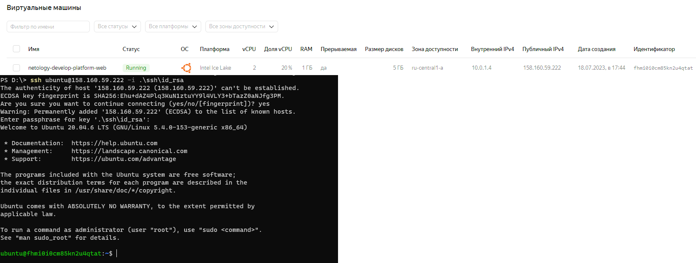

# Домашнее задание к занятию «Основы Terraform. Yandex Cloud»

### Задание 1
В качестве ответа всегда полностью прикладываете ваш terraform-код в git!

1. Изучите проект. В файле variables.tf объявлены переменные для yandex provider.
2. Переименуйте файл personal.auto.tfvars_example в personal.auto.tfvars. Заполните переменные (идентификаторы облака, токен доступа). Благодаря .gitignore этот файл не попадет в публичный репозиторий. **Вы можете выбрать иной способ безопасно передать секретные данные в terraform.**
3. Сгенерируйте или используйте свой текущий ssh ключ. Запишите его открытую часть в переменную **vms_ssh_root_key**.
4. Инициализируйте проект, выполните код. Исправьте намеренно допущенные синтаксические ошибки. Ищите внимательно, посимвольно. Ответьте в чем заключается их суть? 
5. Ответьте, как в процессе обучения могут пригодиться параметры```preemptible = true``` и ```core_fraction=5``` в параметрах ВМ? Ответ в документации Yandex cloud.

    ### Ответ:

    0. Закоммитил с комментарием "terraform_hw2_exercise_1"
    1. Изучил
    2. Переименовал и заполнил переменные
    3. Использовал свой ssh ключик, положил в `personal.auto.tfvars`
    4. Ошибки
       - `platform_id` - выбран идентификатор платформы не из перечня провайдера - https://cloud.yandex.ru/docs/compute/concepts/vm-platforms
       - `core_fraction` и `cores` - выбраны параметры не из перечня провайдера в зависимости от выбранной платформы - https://cloud.yandex.ru/docs/compute/concepts/performance-levels 
    5. Выставление обоих апраметров существенно снижает стоимость ВМ, а также
       - `preemptible = true` - делает ВМ прервываемой, что позволяет принудительно остановить ВМ при истечении 24х часов после запуска или если не хвататет ресрусов на запуск обычной ВМ в той же зоне доступности
       - `core_fraction` - уровень производительности, который определяет долю вычислительного времени физических ядер, которую гарантирует vCPU.
    
