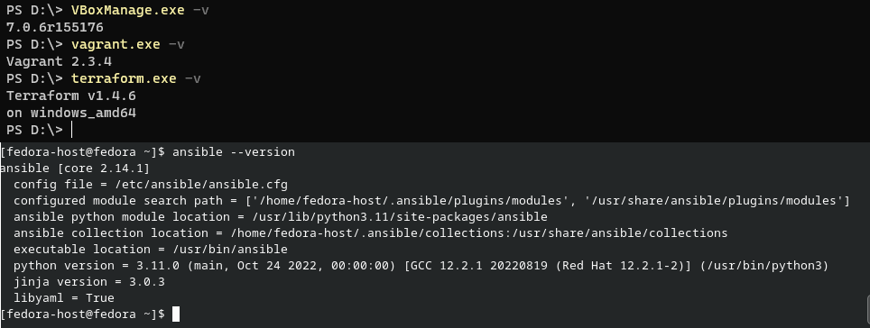
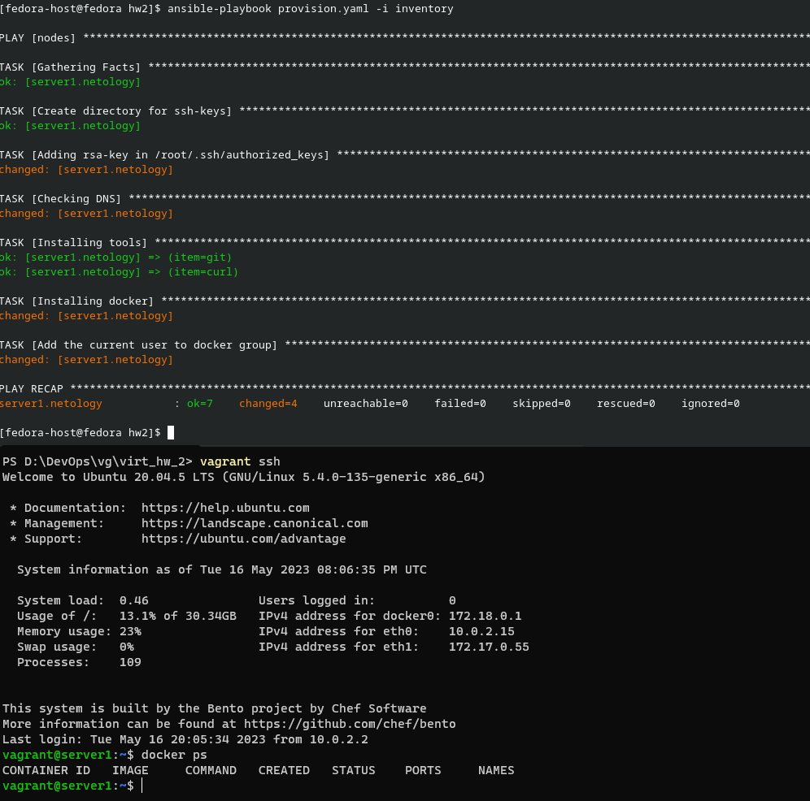

# Домашнее задание к занятию 2. «Применение принципов IaaC в работе с виртуальными машинами»

## Задача 1

- Опишите основные преимущества применения на практике IaaC-паттернов.
- Какой из принципов IaaC является основополагающим?


### Ответ:

    - Преимущества:
        - Увеличение скорости поставки фич (Time-To-Lead)
        - сокращение стоимости исправления дефектов, за счет раннего обнаружения на этапе CI
        - повышение стабильности сред 
    - Индепотентность, повторяемость результата между запусками 

## Задача 2

- Чем Ansible выгодно отличается от других систем управление конфигурациями?
- Какой, на ваш взгляд, метод работы систем конфигурации более надёжный — push или pull?

### Ответ:

    - Низкий порог вхождения, ssh  в качестве канала связи без установки агентов, скорость
    - Push, так как в таком случае инициатором являемся мы и можем на гораздо более раннем этапе понять что с управляемым хостом что-то не так
## Задача 3

Установите на личный компьютер:

- [VirtualBox](https://www.virtualbox.org/),
- [Vagrant](https://github.com/netology-code/devops-materials),
- [Terraform](https://github.com/netology-code/devops-materials/blob/master/README.md),
- Ansible.

### Ответ:
    В качестве домашней ситемы использую Windows, а для ansible использую ВМ с Fedora
    Так что следующее задание приходится делать пополам:
    - vagrant + virtualbox на хостовой машине
    - ansible на гостевой
   

## Задача 4 

Воспроизведите практическую часть лекции самостоятельно.

- Создайте виртуальную машину.
- Зайдите внутрь ВМ, убедитесь, что Docker установлен с помощью команды
```
docker ps
```
### Ответ:

    В качестве домашней ситемы использую Windows, а для ansible использую ВМ с Fedora
    Так что следующее задание приходится делать пополам:
    - vagrant + virtualbox на хостовой машине
    - ansible на гостевой
    
   
