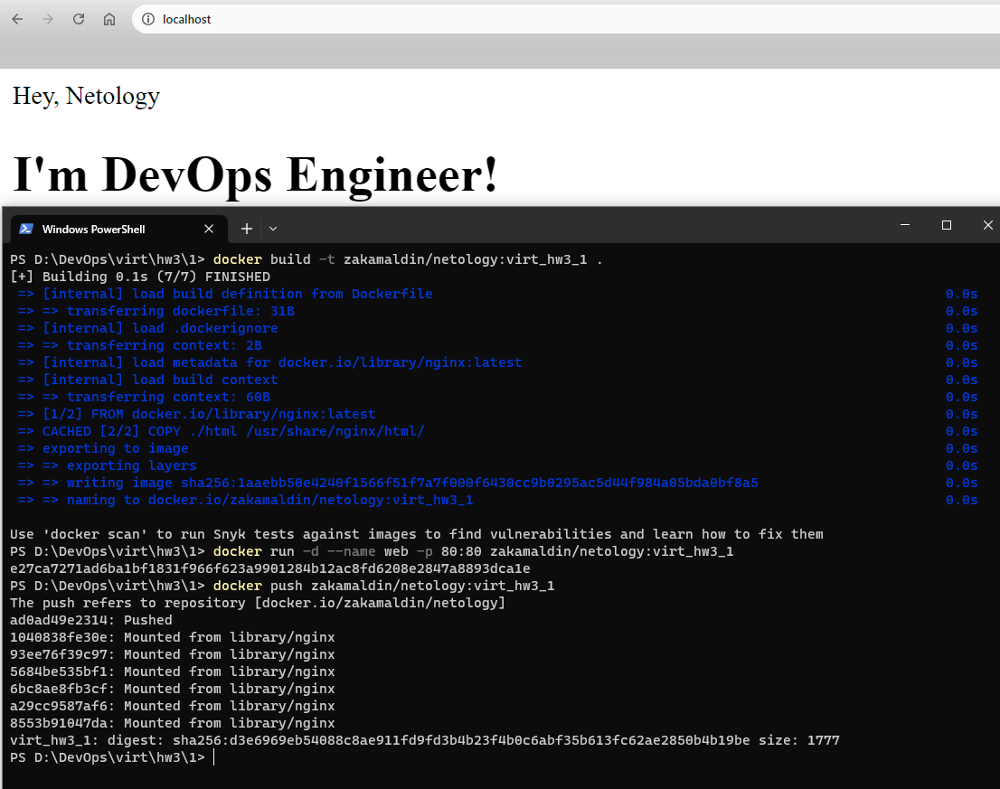
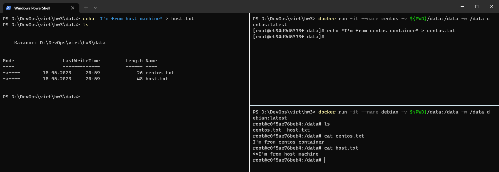

# Домашнее задание к занятию 3. «Введение. Экосистема. Архитектура. Жизненный цикл Docker-контейнера»

## Задача 1

Сценарий выполнения задачи:

- создайте свой репозиторий на https://hub.docker.com;
- выберите любой образ, который содержит веб-сервер Nginx;
- создайте свой fork образа;
- реализуйте функциональность:
запуск веб-сервера в фоне с индекс-страницей, содержащей HTML-код ниже:
```
<html>
<head>
Hey, Netology
</head>
<body>
<h1>I’m DevOps Engineer!</h1>
</body>
</html>
```

Опубликуйте созданный fork в своём репозитории и предоставьте ответ в виде ссылки на https://hub.docker.com/username_repo.

### Ответ:
https://hub.docker.com/layers/zakamaldin/netology/virt_hw3_1/images/sha256-d3e6969eb54088c8ae911fd9fd3b4b23f4b0c6abf35b613fc62ae2850b4b19be?context=explore 

    docker run -d --name web -p 80:80 zakamaldin/netology:virt_hw3_1

   

## Задача 2

Посмотрите на сценарий ниже и ответьте на вопрос:
«Подходит ли в этом сценарии использование Docker-контейнеров или лучше подойдёт виртуальная машина, физическая машина? Может быть, возможны разные варианты?»

Детально опишите и обоснуйте свой выбор.

### Ответ:

Сценарий:

- высоконагруженное монолитное Java веб-приложение
  - особой разницы нет, где запускать приложение, так как Java все равно где запускаться, все зависит от потребляемых памяти и ядер
- Nodejs веб-приложение
  - Docker отлично подойдет для таких задач, однако как Java, так и Nodejs не накладывает ограничений на среду исполнения
- мобильное приложение c версиями для Android и iOS
  - Если речь идет про сборку:
    - для Apple требуется компьютер с MacOS, например Mac mini с серверной ОС, и сертификатами для подписи приложения и выкладки в AppStore, так что подойдет
    - Что касается Android - хватит и ВМ/Физ.сервер со специализированным софтом для сборки и выкладки
  - Если речь идет про серверные части приложений - опять же неважно где режит приклад, но Docker препочтительнее, так как его легко масштабировать
- шина данных на базе Apache Kafka
  - Для отказоусойчивости лучше выносить брокеры кафки на отдельные узлы(лично встречал 57 брокеров на разных ВМ), однако никто не запрещает сделать кластер на одном хосте в докере(https://dotsandbrackets.com/highly-available-kafka-cluster-docker-ru/)
- Elasticsearch-кластер для реализации логирования продуктивного веб-приложения — три ноды elasticsearch, два logstash и две ноды kibana
 - Это можно заставить работать внутри докера, но придется очень сильно править конфиги для стека, так как все три компонента зависят друг от друга 
   Есть успешные примеры https://dotsandbrackets.com/highly-available-kafka-cluster-docker-ru/
   https://github.com/sqshq/ELK-docker/blob/master/docker-compose.yml

   Однако приведенная конфиуграция нацеленна на отказоустойчивость, что сложно будет сделать на одном хосте
   Плюс нельзя забывать что логи весят много и стек требцет много ресурсов для обработки таких массивов данных:
   https://habr.com/ru/companies/domclick/articles/507072/
- мониторинг-стек на базе Prometheus и Grafana
  - Prometheus - Да, отличный варниант длдя запуска в контейнера, так как это просто сборщик метрик
  - Grafana - лучше вынести в отдельную ВМ или физ.сервер, так как обратботка метрик мало отличается от обработки логов в стеке ELK выше
- MongoDB как основное хранилище данных для Java-приложения
 - лучше оставить на ВМ или физ.сервере, так как NoSQL БД требует много физ памяти
- Gitlab-сервер для реализации CI/CD-процессов и приватный (закрытый) Docker Registry
 - Gitlab - можно вынести в докер, однако CI/CD будет требовать ресурсов для запуска пайплайнов, надо учесть это в выделяемых ресурсов
 - Docker Registry имеет смысл вынести на отдельную ВМ или физ.сервер так как по сути это большое файловое хранилище, докер не подходит для таких работ

## Задача 3

- Запустите первый контейнер из образа ***centos*** c любым тегом в фоновом режиме, подключив папку ```/data``` из текущей рабочей директории на хостовой машине в ```/data``` контейнера.
- Запустите второй контейнер из образа ***debian*** в фоновом режиме, подключив папку ```/data``` из текущей рабочей директории на хостовой машине в ```/data``` контейнера.
- Подключитесь к первому контейнеру с помощью ```docker exec``` и создайте текстовый файл любого содержания в ```/data```.
- Добавьте ещё один файл в папку ```/data``` на хостовой машине.
- Подключитесь во второй контейнер и отобразите листинг и содержание файлов в ```/data``` контейнера.

### Ответ:
    Так как хостовая машина на Windows, а докер образы линуксовые, то из-за различий в способе записи Unicode, тексn из виндовой машины читается с артефактами из линукс-контейнера(Byte Order Mark или BOM)
   