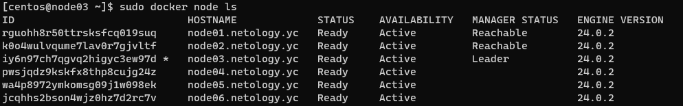
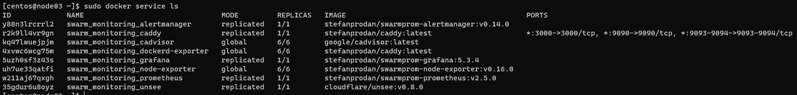
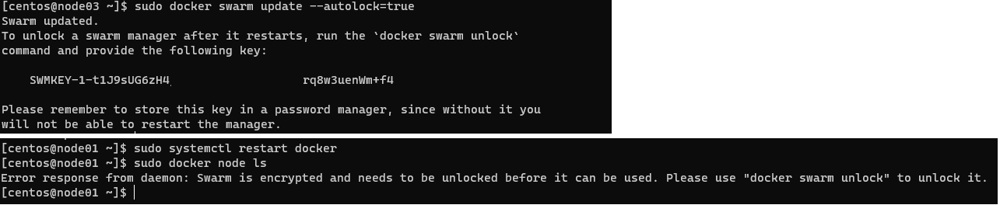

# Домашнее задание к занятию 5. «Оркестрация кластером Docker контейнеров на примере Docker Swarm»

## Задача 1

Дайте письменые ответы на вопросы:

- В чём отличие режимов работы сервисов в Docker Swarm-кластере: replication и global?
- Какой алгоритм выбора лидера используется в Docker Swarm-кластере?
- Что такое Overlay Network?

### Ответ:

- В чём отличие режимов работы сервисов в Docker Swarm-кластере: replication и global?
  - В режиме `global` сервис будет запущен на каждой из нод в кластере, если нод 5 то и сервисов 5
  - При режиме `replication` необходимо указать общее количество сервисов, которо будет запущено на всех доступных нодах, если нод 5, а реплик 3, то будет запущено 3 сервиса, распределенных между всеми доступными нодами

- алгоритм распределённого консенсуса Raft, позволяющий в группе нескольких нод всегда определить лидера, даже в случае недоступности текущего лидера. Если в текущей группе нет лидера, в каждой из нод запускается рандомный таймер, по истичению которого нода оповещает остальных, что хочет стать лидером, прерывая их таймер, если большинство ответило проголосовало "за", то эта нода становится лидером

- Это сеть, которая создана поверх другой сети, в случае с docker - позволяет объеденить несколько dosker хостов в одну сеть для образования кластера


## Задача 2

Создайте ваш первый Docker Swarm-кластер в Яндекс Облаке.

Чтобы получить зачёт, предоставьте скриншот из терминала (консоли) с выводом команды:
```
docker node ls
```
### Ответ:
   

## Задача 3

Создайте ваш первый, готовый к боевой эксплуатации кластер мониторинга, состоящий из стека микросервисов.

Чтобы получить зачёт, предоставьте скриншот из терминала (консоли), с выводом команды:
```
docker service ls
```

### Ответ:
   

## Задача 4 (*)

Выполните на лидере Docker Swarm-кластера команду, указанную ниже, и дайте письменное описание её функционала — что она делает и зачем нужна:
```
# см.документацию: https://docs.docker.com/engine/swarm/swarm_manager_locking/
docker swarm update --autolock=true
```

### Ответ:
    По умолчанию докер шифрует все данные на диске и в момент рестарта менеджера в него загружается ключ шифрования, который позволяет получить доступ к зашифрованным данным

    Автоблокировка позволяет управлять процесом взвращения менеджера в группу, не давая вернуться ему автоматически, пока администратор не введет пароль сгенерированный докером.
  


